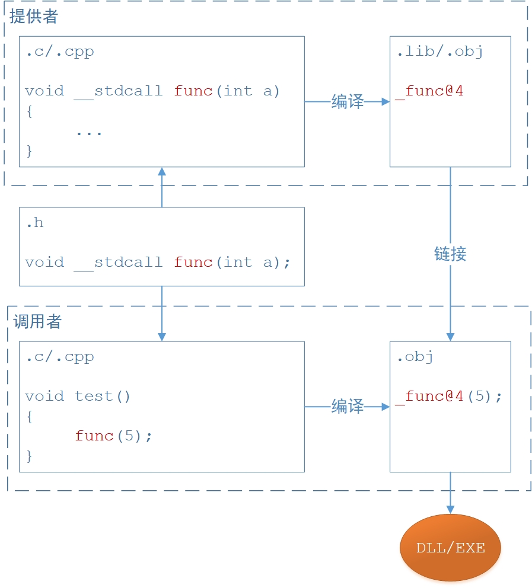
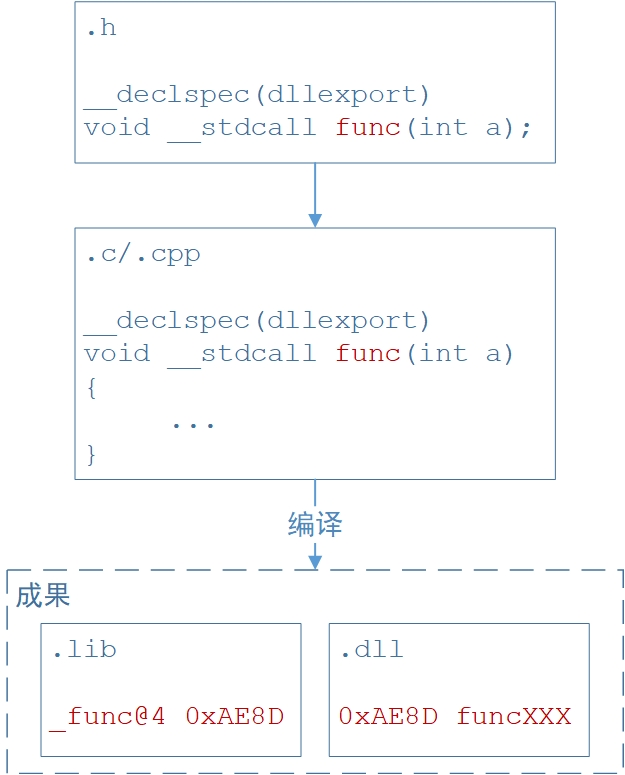
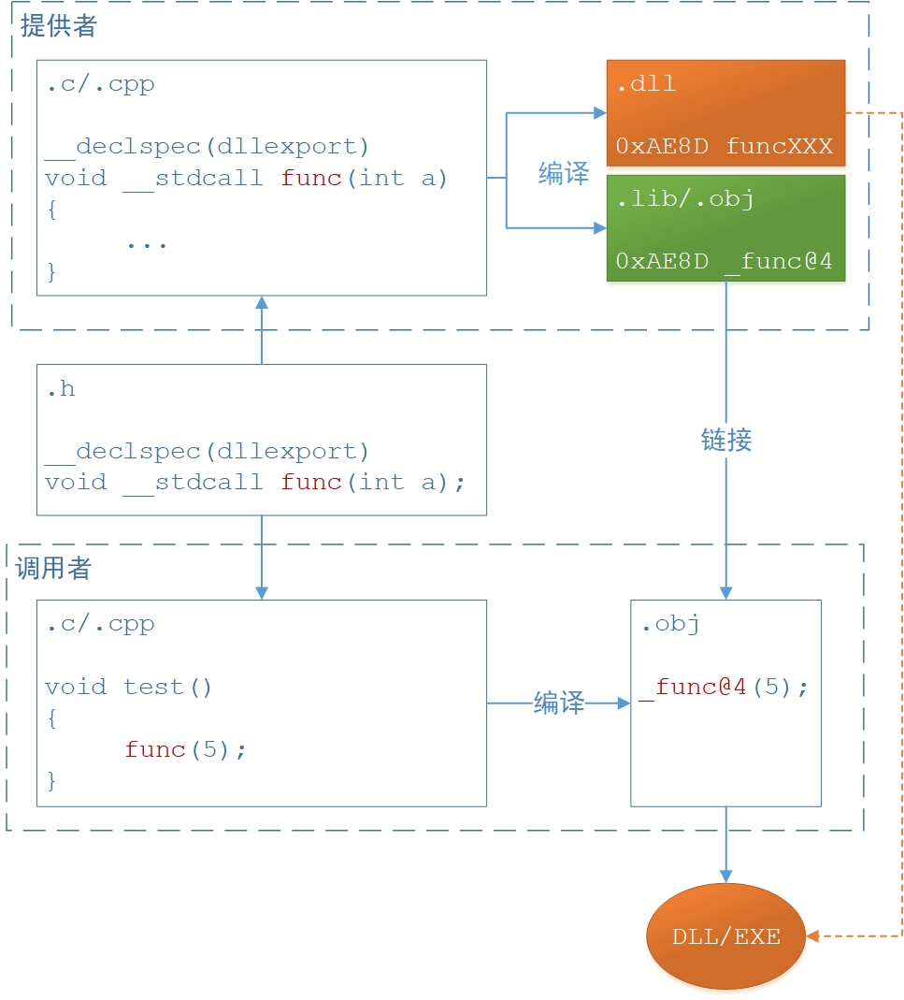
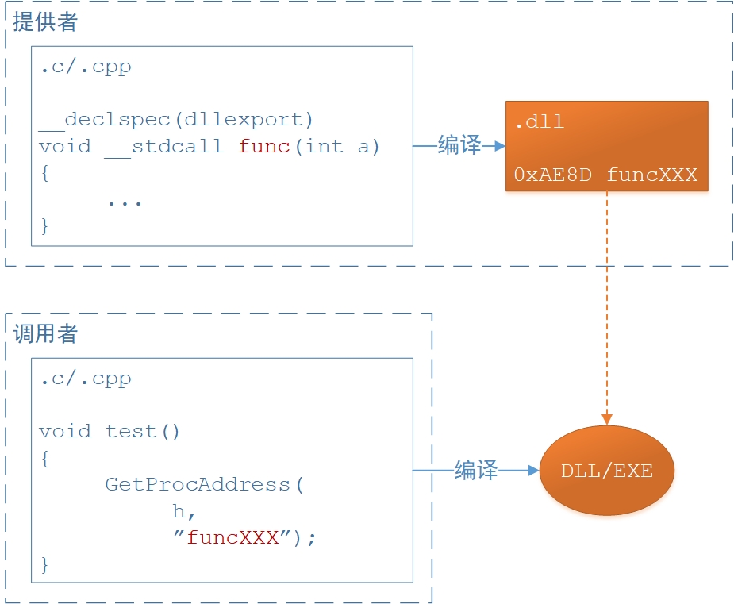

# 函数调用约定与函数导出

*本文分为两大部分，「调用约定」和「函数导出」，然后在末尾对一些话题进行较浅的拓展。*


## 调用约定 - 概述

我们熟知的函数由几个部分组成：

1. 返回值类型；
2. 函数名称；
3. 参数（参数类型和个数）；


而事实上，函数还有一个很重要的组成部分：***调用约定*** ，也就是对函数调用的约束和规定，它决定了以下内容：

1. 函数参数的压栈顺序；
2. 由调用者还是被调用者进行函数栈的清理；
3. 对函数名称的修饰方式；

常见的函数调用约定有：

1. __cdecl
2. __stdcall
3. __fastcall
4. __thiscall

> 备注：
>
> - VC中常见的一些宏例如“WINAPI”、"CALLBACK"，其实就是__stdcall；
> - 从调用约定所影响的内容来看，主要是两大方面：***函数栈区的影响***、***函数名称修饰的影响*** ；


## 调用约定 - 对函数栈区的影响

### __cdecl

1. C/C++默认的调用约定；
2. 函数参数 ***从右到左*** 入栈；
3. 函数调用结束后，由 ***调用者*** 进行栈区的清理；
4. 问题：不同编译器设定的栈结构不尽相同，跨开发平台时由函数调用者清理栈区不可行；
5. 问题：每次调用都包含清理栈区的代码，故可执行文件较大；
6. 优点：像 printf 这种具有可变参的函数，只有调用者知道实际参数是多少个，决定了这种函数只能使用这种调用约定；


### __stdcall

1. Windows API默认的调用约定；
2. 函数参数 ***从右到左*** 入栈；
3. 函数调用结束后，由 ***被调用者*** 进行栈区的清理；


### __fastcall

1. 适用于对性能要求较高的场合；
2. ***从左开始不大于4字节*** 的参数放入CPU的ECX和EDX寄存器，其余参数 ***从右向左*** 入栈；
3. 函数调用结束后，由 ***被调用者*** 进行栈区的清理；
4. 优点：如果参数不大于4字节，则这种调用约定可提高性能；


### __thiscall

1. C++类成员函数缺省的调用约定，不需要也不能显式声明；
2. 因为C++类成员函数的调用会自动传入 this 这个指针参数；
3. 函数参数：***从右到左*** 入栈；
4. this 指针参数：
    - 若参数个数确定，则通过ECX传递给被调用者；
    - 若参数个数不确定，则在所有参数入栈后再被压入栈；
5. 栈区清理：
    - 若参数个数确定，则 ***被调用者*** 清理；
    - 若参数个数不确定，则 ***调用者*** 清理；


## 调用约定 - 对函数名称修饰的影响 - C编译器

### __cdecl

- 规则：一个下划线前缀，函数名；
- 格式：_FunctionName；
- 例如：void Input(int a, int b) 被修饰为 _Input；


### __stdcall

- 规则：一个下划线前缀，函数名，一个@符号，参数的字节数；
- 格式：_FunctionName@Number；
- 例如：void Input(int a, int b) 被修饰为 _Input@8；


### __fastcall

- 规则：一个@符号前缀，函数名，一个@符号，参数的字节数；
- 格式：@FunctionName@Number；
- 例如：void Input(int a, int b) 被修饰为 @Input@8；


## 调用约定 - 对函数名称修饰的影响 - C++编译器

###  规则 

1. 一个 ? 符号前缀
2. 函数名；
3. 两个@符号，调用约定标识；
4. 参数表；
5. 结束符；

###  函数名 

- 非类成员函数：函数名；
- 类成员函数：函数名，一个@符号，类名；

###  调用约定标识 

- __stdcall：YG；
- __cdecl：YA；
- __fastcall：YI；
- __thiscall：QAE(public)，IAE(protected)，AAE(private)；
- __thiscall const：QBE(public)，IBE(protected)，ABE(private)；

###  参数表 

> 首先说明：参数表中第一个是返回值，第二个开始才是函数参数：

- X：void
- D：char
- E：unsigned char
- F：short
- H：int
- I：unsigned int
- J：long
- K：unsigned long
- M：float
- N：double
- _N：bool
- U：结构类型，后面跟上结构体名称，用“@@”表示名称结束
- PA：指针，后面跟上指针类型，若相同类型指针连续出现，以“0”代替，一个“0”代表一次重复
- PB：const 指针，与PA一致
- AAV1：该类实例的引用
- ABV1：该类实例的 const 引用

###  结束符 

- `@Z` 标识整个名字的结束
- 如果该函数无参数，则以 `XZ` 标识结束；

###  举例 

例如：

```cpp
/*
?Test1@@YGHPADK@Z
*/
int __stdcall Test1(char* var1, unsigned long ulP); 
```

例如：

```cpp
/*
?Test2@@YAXXZ
*/
void __cdecl Test2()
```

例如类方法：

```cpp
class CTest 
{
private: 
    void Function(int); 
protected: 
    void CopyInfo(const CTest &src); 
public:
    long DrawText(HDC hdc, long pos, const TCHAR* text, RGBQUAD color, BYTE bUnder, bool bSet);
    long InsightClass(DWORD dwClass) const;
};
```

- Function：

```cpp
?Function@CTest@@AAEXH@Z
```

- CopyInfo：

```cpp
?CopyInfo@CTest@@IAEXABV1@@Z
```

- DrawText：

```cpp
/*
TCHAR其实是char 
BYTE其实是unsigned char 
HDC其实是HDC结构类型的指针 
RGBQUAD其实是结构体tagRGBQUAD 
*/
?DrawText@CTest@@QAEJPAUHDC@@JPBDUtagRGBQUAD@@E_N@Z
```

- InsightClass：

```cpp
/*
DWORD其实是unsigned long 
*/
?InsightClass@CTest@@QBEJK@Z
```


## C & C++ 混合编程

### 问题描述

从前面讲的内容可以看到：

1. 调用约定对函数栈区会产生影响，但是， 这个影响与C/C++编译器是无关的；
2. 调用约定对函数名称修饰会产生影响，而且，C/C++编译器的规则是不一样的；

而C/C++混合编程的时候，问题是：

- 假设C程序中提供了一个方法，该方法使用C编译器编译（可能C程序通过.o/.obj文件输出并进行后期link，或者通过LIB/DLL等形式输出）
- 然后在C++程序中需要使用该方法，且C++程序使用C++编译器编译
- 那么，在保证了二者的调用约定一致的情况下，仍然会出现C++编译器找不到该方法实现体的问题

原因很好理解：

- 因为C/C++编译器使用了不同的函数名称修饰
- 而要解决这个问题，就是让C++编译器使用C编译器的函数名称修饰方式
- 也就是 `extern "C"`


### extern "C"

> `extern "C"` 这句话的作用，就是要求统一使用C编译器的方式，来进行函数名称的修饰。

例如，在C程序中该方法如下：

```c
void __stdcall funC() {}
```

那么，在C++程序中，要使用该C方法之前，先进行声明（至于为何还要再加一个extern，那是C的知识，与本文无关）：

```cpp
extern "C" void extern __stdcall funC();
```

如果要使用的C方法比较多，则可以如下：

```cpp
extern "C" {
	int extern stdcall funC1();
	char extern stdcall funC2();
	void extern __stdcall funC3();
}
```

然后，在C++程序中，就可以直接使用该C方法了：

```cpp {4}
class CTest
{
public:
    void f() { funC3(); }  
};
```


### __cplusplus

> `__cplusplus` 这个宏是 CPP 文件自带的，其作用如下：

- 只有 C++ 才提供 `extern "C"` 这个符号，C编译器是不认识这个符号的
- 也就是说，如果是C++编译器，才认识 `extern "C"` 这个符号
- 因为，C程序可能将方法统一声明在一个 .H 中，并提供给不同的使用者使用，而使用者可能是C程序，也可能是C++程序
- 因此，就需要做一个判断，如果是C++程序，那就加上 `extern "C" ` ，如果不是C++程序，那就不用加上 `extern "C"` 了，否则C编译器不认识该符号

> 因此，我们就可以将对外提供的方法统一定义在一个.H文件中，如下：

```c {1,2,9}
#ifdef __cplusplus
extern "C" {
#endif

int extern __stdcall funC1();
char extern __stdcall funC2();
void extern __stdcall funC3();

#ifdef __cplusplus
}
#endif
```


## 函数的导出 - 概述

函数导出的目的，是为了提供给使用者使用，因此需注意几点：

1. 调用约定会对 ***函数栈区*** 产生影响，只有调用者和被调用者都使用同样的约定，才能保证程序正常的运行
2. 调用约定会对 ***函数名称*** 产生影响，且不同的编译器对函数名称的修饰是不同的

因此，对于 ***调用者和被调用者*** ，要注意：

1. 都需要使用相同的 ***调用约定***
2. 确保使用相同编译器的 ***函数名修饰方式*** 

> 因此，在上述关于C/C++混合编程一节中已经讲得很清晰了：从通用和严谨的角度来说，若涉及到函数的导出与共享，则 `extern "C"` 和 `__cplusplus` 都是必须使用的

函数导出的本质可以理解为一种 ***分工*** ，也就是说：

- 调用者需要使用某个函数
- 而这个函数的实现由提供者来完成
- 因此，函数导出也可以理解为函数体（函数实现）的一种共享

因此，根据这个理解，可以将函数导出分为几类：

1. ***编译时*** ，也就是编译期间就得到了函数体，并包含在使用者程序内，函数体属于使用者程序的一部分；例如 `.lib` , `.obj` 等；
2. ***运行时*** ，也就是运行期间才获取或加载函数体，函数体与使用者是独立的两个模块；例如 `.dll` , `.exe` 等；因此，调用者在使用这些导出函数时，又分为 ***静态加载*** 和 ***动态加载*** ；


## 函数的导出 - 编译时

### 要素

编译时的函数导出与使用比较简单：

1. 提供者，`.h` ，用来声明函数；
2. 提供者，`.c/.cpp` ，用来实现函数；
3. 提供者，编译为` .lib/.obj` 等；
4. 使用者，引入 `.h` 及 `.lib` ，即可直接使用函数；

例如，头文件 `a.h` 声明如下：

```cpp
#ifdef __cplusplus
extern "C" {
#endif

void __stdcall func(int a);

#ifdef __cplusplus
}
#endif
```

对应的，函数体 `a.cpp` 实现如下：

```cpp
void __stdcall func(int a)
{
    //...
}
```

编译之后：

- 可能编译为 `.lib` ，或者 `.obj` 等
- 因此，将头文件，编译后的函数体，交给调用者即可；

而调用者则可直接使用如下：

```cpp {1,2,5}
#include "a.h"
#pragma comment (lib, "a.lib")
void test()
{
    func(5);
}
```


### 原理

在该过程中，提供者、调用者、编译器的工作，可用下图来表示：



根据上图进行总结，要点如下：

1. 对于提供者和调用者来说，头文件都遵循了统一的 ***调用约定*** 和 ***编译器函数名修饰*** 规则；
2. 对于提供者和调用者来说，只需要关心头文件中的函数名称即可；
3. 对于编译器来说，都根据头文件中的调用约定和函数名称，进行了函数名的修饰，但是这个修饰对于提供者和调用者来说是透明的；

结合上图，看函数名称的变化：

1. 头文件中声明函数名是 `func` ；
2. 函数实现时实现为 `func` ；
3. 函数体 `func` 被编译为 `_func@4` ；
4. 调用者代码中根据头文件的名称直接调用 `func` ；
5. 调用者代码中的 `func` 被编译为 `_func@4` ；
6. 因此，提供者和调用者在程序中都统一使用 `func` ；
7. 但是，提供者和调用者在编译后都统一使用了 `_func@4` ，编译器能够正常完成链接和编译；


## 函数的导出 - 运行时

### 原理

运行时的函数导出与使用包括如下要素：

1. 提供者，`.h` ，用来声明导出函数；
2. 提供者，`.c/.cpp` ，用来实现函数；
3. 提供者，编译为 `.dll` 及对应的 `.lib` ；
4. 使用者，引入 `.h` 及 `.lib` ，即可直接使用函数，即 ***静态加载*** ；也可只使用 `.dll` 或 `.exe` ，即 ***动态加载*** ；

过程可用下图来表示：



从上图可以看到：

1. 导出涉及到一些语法，且上图只是其中一种语法，后续会讲解各种导出方式；
2. 导出后可以得到 `.lib` ，`.dll` ；
3. 对于 `.lib` 来说，函数名称修饰遵循前面所总结的规则，即 ***调用约定*** 和 ***编译器函数名修饰*** ；
4. 对于 `.dll` 来说，函数名称可以有多种形态，后续会分别讲解；

需要注意的是，「运行时」函数导出与前面所讲的「编译时」函数导出虽然都有 `.lib` ，但其实区别很大的：

- 「编译时」的函数导出，`.lib` 中包含了函数体；
- 「运行时」的函数导出，`.lib` 中只是包含了函数在 `.dll/.exe` 中的名称和地址等信息，函数体在 `.dll/.exe` 中；


### 导出 - __declspec(dllexport)

> 这是一种在DLL中导出函数的方式，使用 `__declspec(dllexport)` 语法。

- 注意，目的只是为了DLL函数的导出，而其中涉及到 `.dll` 和 `.lib` 
- 对于 `.lib` 来说，函数名称遵循 ***调用约定*** 和 ***编译器函数名修饰*** 
- 但对于 `.dll` 来说，函数名称有几种情况：
    - 第一种情况：
        - 使用C/C++默认的调用约定，即 `__cdecl` ，由于是默认的，可以不用显式声明；
        - 使用C编译器的名称修饰方式，即 `extern "C"` ；
        - 在这种情况下，`.dll` 中的函数名称就不会进行额外修饰；
    - 第二种情况：
        - 即不满足第一种情况的任何一种形式；
        - 此时 .dll 中的函数名称修饰由调用约定和编译器决定；

举例：`.dll` 中的函数名称是 `func`；

```cpp
#ifdef __cplusplus
extern "C" {
#endif

__declspec(dllexport) void func(int a);

#ifdef __cplusplus
}
#endif
```

举例：`.dll` 中的函数名称是 `func` ；

```cpp
#ifdef __cplusplus
extern "C" {
#endif

__declspec(dllexport) void __cdecl func(int a);

#ifdef __cplusplus
}
#endif
```

举例：`.dll` 中的函数名称是 `_func@4` ；

```cpp
#ifdef __cplusplus
extern "C" {
#endif

__declspec(dllexport) void __stdcall func(int a);

#ifdef __cplusplus
}
#endif
```

举例：在C++编译器中，`.dll` 中的函数名称是 `?Test1@@YGHPADK@Z` ；

```cpp
__declspec(dllexport) int __stdcall Test1(char* var1, unsigned long ulP);
```


### 导出 - .def模块文件

> 这是另一种导出DLL函数的方式，使用 `.def` 模块文件；一样的，目的只是为了DLL函数的导出，而其中涉及到 `.dll` 和 `.lib` 。

1. 对于 `.lib` 来说，函数名称遵循 ***调用约定*** 和 ***编译器函数名修饰*** ；
2. 对于 `.dll` 来说，使用 `.def` 导出的DLL函数名称不会进行额外修饰；

因此，头文件 `a.h` 声明如下：

```cpp
#ifdef __cplusplus
extern "C" {
#endif

void __stdcall func1(int a);
int __stdcall func2(char c);

#ifdef __cplusplus
}
#endif
```

对应的，`.def` 文件如下定义：

```cpp {3,4}
LIBRARY "DllName"
EXPORTS
func1 @1 NONAME 
funcX = func2 @2 NONAME
```

`.def` 文件说明如下：

- `LIBRARY` ，声明DLL库的名称；
- `EXPORTS` ，开始声明要导出的函数；

要导出的函数格式：`函数别名 = 函数名 @ 序号 [NONAME]`

- `函数别名` ，就是给所导出的函数进行重命名，若不重命名，则导出为函数名；
- `函数名` ，就是所要导出的函数名；
- `序号` ，使用者可根据序号来获取函数；
- `NONAME` ，可选，DLL中不包含函数名，只包含序号，减小DLL的体积；


### 导入 - 静态加载

静态加载时：

- 直接使用 `.lib` 和 `.h` 即可
- 但仍然要注意的是，既然使用到 `.h` ，那么就必须保持一致的 ***调用约定*** 和 ***编译器函数名修饰*** 。

例如，头文件 `a.h` 声明如下：

```cpp
#ifdef __cplusplus
extern "C" {
#endif

void __stdcall func(int a);

#ifdef __cplusplus
}
#endif
```

而调用者则可直接使用如下：

```cpp {2,5}
#include "a.h"
#pragma comment (lib,"a.lib")
void test()
{
    func(5);
}
```

静态加载的原理可通过下图来看：



从图中可以看到：

1. 静态加载时，使用者只需要关注与提供者保持一致的 ***调用约定*** 和 ***编译器函数名修饰*** ，这通过 `.h` 文件即可完成约定；
2. 使用者不用关注在 `.dll` 中的真正函数名称是什么，因为 `.lib` 知道 `.dll` 中的真正函数名和地址；


### 导入 - 静态加载 - __declspec(dllimport)

> 这是一种静态加载DLL中函数的方式，使用语法 `__declspec(dllimport) ` 。注意，目的只是为了DLL函数的导入，且不用该修饰也能正常导入，但是存在一些细微的区别：

1. 不使用该修饰时，编译器不知道该函数是从DLL中导入的，因此会产生一次 ***JMP*** 行为；
2. 使用该修饰时，编译器知道该函数是从DLL中导入的，因此可以直接 ***CALL*** 对应的函数地址；
3. 这涉及到编译原理和运行EXE时的PE文件格式，我也不全懂；

因此，针对DLL提供者的 `.h` 文件，我们就可以如下声明，也是我们平时最常看到的形式：

```cpp {2,4}
#ifdef XXXX
#define MYEXPORT __declspec(dllexport)
#else
#define MYEXPORT __declspec(dllimport)
#endif

MYEXPORT void func(int);
```

其中：

- `XXXX` 是一个宏；
- 对于 ***提供者*** 来说，代码环境中会定义该宏，从而就是 ***导出*** 函数；
- 对于 ***使用者*** 来说，代码环境中未定义该宏，从而就是 ***导入*** 函数；


### 导入 - 动态加载

动态加载时：

- 就不需要使用 `.lib` 和 `.h` 
- 因此此时只关注DLL中的函数
- 所以，此时要关注的是与 ***提供者*** 保持一致的 ***调用约定***，而 ***函数名称*** 则使用DLL中的函数名

动态加载的原理通过下图来看：



对于使用者来说：

1. ***调用约定*** 必须与DLL中的函数保持一致；
2. ***函数名称*** 必须使用DLL中的实际函数名称；


### 导入 - 动态加载 - 获取函数

动态加载时，获取函数有多种方式：

> 根据名称获取

```cpp
GetProcAddress(h, "funcXXX");
```

说明：

- `funcXXX` 就是DLL中实际的函数名称；
- 前提是，DLL导出函数时包含了函数名；

> 根据序号获取

```cpp
GetProcAddress(h, MAKEINTRESOURCE(2));
```

说明：

- `MAKEINTRESOURCE` 就是根据序号来得到函数；
- 序号必须与DLL导出函数时的序号对应；
- 前提是，DLL导出函数时指定了序号；
- 如果DLL导出函数使用了 `NONAME` ，则只能根据序号来获取；


## 总结

> 函数的导出目的就是为了 ***共享*** ，因此，涉及到一致的 ***函数调用约定*** 和 ***编译器函数名称修饰*** 。

而要共享函数，会涉及到 `.h` 文件的定义，所以：

- 调用约定 ***默认*** 是 `__cdecl` ，使用其它调用约定则显式的写明，例如 `__stdcall` ；
- 函数名称修饰最好都指定C方式，即 `extern "C"` ；
- 为了适应C/C++编译器，再增加 `__cplusplus` 判断；
- 针对「运行时」的函数导出，可使用 `__declspec(export)` 或者 `.def` ；
- 针对「运行时」的函数导入，若提供者使用了 `__declspec(export)` ，则导入时最好使用 `__declspec(import)` ；

因此，综合上述要点，针对DLL，一个最全最标准的函数声明 `.h` 就可以是如下格式：

```cpp {2,4,7,8,11,12,14}
#ifdef XXXX
#define MYEXPORT __declspec(dllexport)
#else
#define MYEXPORT __declspec(dllimport)
#endif

#ifdef __cplusplus
extern "C" {
#endif

MYEXPORT void func1(int);
MYEXPORT long func2(char);

#ifdef __cplusplus
}
#endif
```


## 附记

### 查看导出函数

> 使用VS的命令行工具，并使用 `dumpbin` 命令。

查看DLL中的导出函数：

```bash
dumpbin /exports xxx.dll
```

查看LIB中的导出函数：

```shell
dumpbin /linkermember xxx.lib
```

通过上述方式可以做到：

- 剖析一个DLL项目所生成的 `.lib` 和 `.dll` 
- 并通过对比 `.h` ，来查看各自的函数名称的不同


### 从 DLL 提取 LIB

> 有时候我们只有 `.dll` ，只能动态加载，但此时若想静态加载，则需要 `.lib` 文件；可使用VS的命令行工具，按照如下步骤进行：

1. 首先，需要先根据 `.dll` 来得到 `.def` ：

```shell
dumpbin /exports xxx.dll > xxx.def
```

2. 其次，根据 `.def` 文件来得到 `.lib` ，但注意：
    - 要确保 `.def` 已经被修改为标准的 `.def` 文件格式
    - 其中，`x86` 或者 `x64` 表示所生成的 `.lib` 对应的目标机器类型

```shell
lib /def:xxx.def /machine:x86 out/:xxx.lib
```

需要注意的是：

1. 这样的提取方式采用的是 C/C++默认的 `__cdecl` ***调用约定*** 和 ***C编译器函数名修饰*** ；
2. 因此，要注意是否与DLL提供者的 ***调用约定*** 一致；
3. 另外，头文件 `.h` 总是需要的，可自己编写，但要确保 ***调用约定*** 和 ***编译器函数名修饰*** 与DLL提供者一致；


### DLL FORWARD 技术

*考虑一种需求场景：*

> - 厂商 A 提供了 `A.dll` 
> - 服务商 S 需要进行一些包装，并且增加一些函数后作为 `S.dll` 再提供给用户
> - 而且，服务商 S 希望对于用户来说，只需要统一的访问 `S.dll` 即可，而不用同时面对 `A.dll` 和 `S.dll` 
> - 但是，服务商没有厂商 `A.dll` 的源代码，就算有，可能也存在编译、依赖等不可知的问题

那么，***dll forword*** 技术就是用来解决这个问题的：

- 假设 `A.dll` 中有函数 `fa1` 和 `fa2` ，那么，在 `S.dll` 中只需如下进行 ***forward*** ：

```cpp
#pragma comment(linker, "/export:fa1=A.fa1")
#pragma comment(linker, "/export:fa2=A.fa2")
```

- 这样，`S.dll` 中就包含了 `A.dll` 中的方法，剩余的工作就是在 `S.dll` 中开发新增接口即可：

```cpp
extern "C" __declspec(dllexport) void fs3(int a)
{
	//...
}
```

- 因此，对于用户来说，统一通过 `S.dll`，即可以访问到 `fa1`，`fa2`，`fs3` 。


