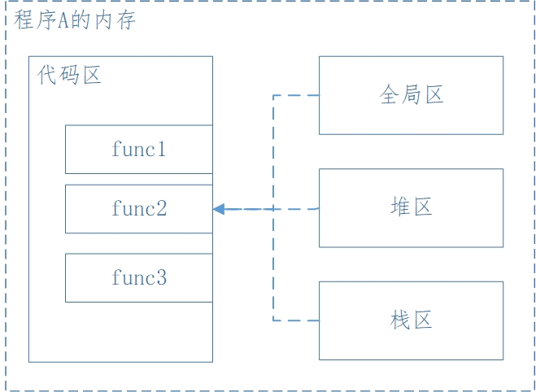
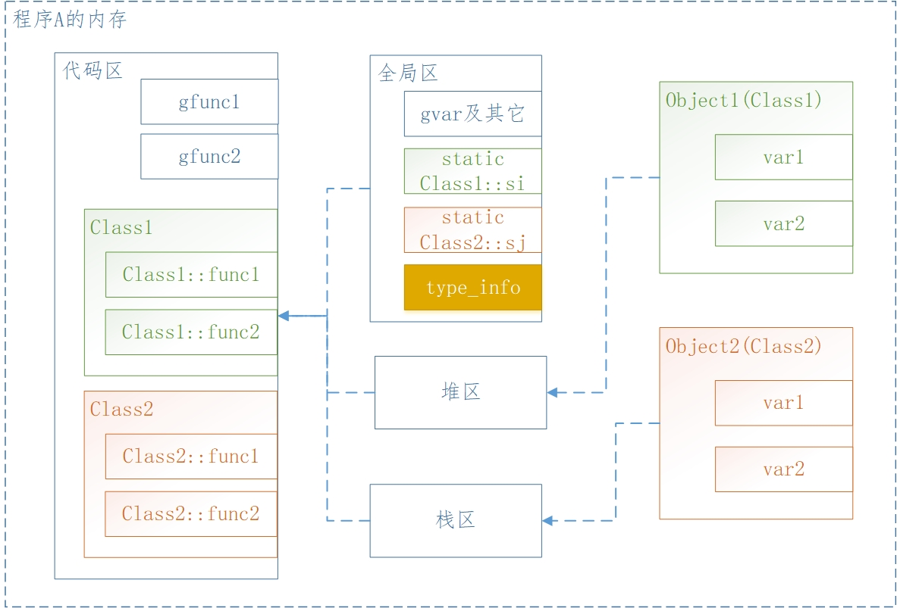

# 从内存模型分析 C++ 的面向对象机制

## 前言

> - *这是一篇循序渐进的文章，从简单开始，到后续讨论的内容变得逐渐复杂，而背后的规则却变得越来越简单和清晰。想起一句话：`山高月小，水落石出。`*
> - *另外，口头表达问题容易，写文章不易。因为写文章需要梳理、沉淀、并确保逻辑正确，且还需要考虑图示、规则总结；*


要测试这些内存模型机制，可以自行编写测试程序来验证，同时，在VS中也提供了分析手段：打开VS的命令提示行工具，使用如下命令：

```shell
cl [filename].cpp /d1reportSingleClassLayout[className]
```

例如，代码文件是 `Test.cpp` ，该 cpp 内的类名是 `CTest` ，则命令如下：

```shell
cl Test.cpp /d1reportSingleClassLayoutCTest
```

注意，`[className]` 前面没有空格。


## C 的内存区域分类

C 的内存分为 4 个区，当然，也可能按照存储的内容不同，细分描述为更多的区，或者对于某个区，可以细分出更多的类型，但从运行的角度来看，用 4 个区来描述已足够。

> 4 个分区如下：

- 全局存储区：全局变量、静态变量、常量区（例如 `char* s = "abc"` 这种字符串常量，注意不是指 `const` 修饰的变量）；
- 栈（***Stack***）：由编译器在需要时自动分配，不需要时自动清理的区域。主要是函数的参数、函数的局部变量、函数内通过代码块形成的局部生存区域；
- 堆（***Heap***）：由程序员在需要时手动分配，不需要时手动释放的区域，如果不释放，则在程序退出时 OS 自动释放；
- 代码区：存放函数代码。代码区包括操作码和操作数的地址，而操作数的地址则涉及到全局存储区、堆区等；如果涉及到局部数据，则先在栈区分配空间，然后引用栈区地址；如果是立即数（即具体的数值，例如 8 ），则直接包含在代码中；另外，函数本身也有地址，也就是函数在代码区的地址；

> 在一个程序运行时，上述内存区域是有分布和排列的，但针对不同的操作系统、不同的编译器，具体内存分布排列不在此文中研究，因为清楚认识到内存区域的分类已经足够了。

下面这段代码来分别说明各个内存区域的使用：

```c
//ga在全局区域
int ga = 0;
//gp在全局区域
char *gp;

void funcTest()
{
    //b在栈区
    //1是立即数，直接包含在代码中
    int b = 1;
    
    //c在全局区，不会因为函数的结束而被销毁
    static int c =0;
    
    //s在栈区
    //"abc"常量在全局区
    char s[] = "abc";
    //p3在栈区
    //"123456"常量在全局区
    char *p = "123456";
    
    //p1、p2在栈区
    char *p1，*p2;
    //分配得到的10个字节在堆区
    p1 = (char*)malloc(10);
    //分配得到的20个字节在堆区
    p2 = (char*)malloc(20);
    //释放p1所指向的堆区的10个字节
    //但p1本身所占用的内存由栈区自动释放
    free(p1);
    //释放p2所指向的堆区的20个字节
    //但p2本身所占用的内存由栈区自动释放
    free(p2);
}
```

下面的示意图反应了内存区域的关系，只是示意图，并不严谨：




## C++ 面向对象 - 封装

### 内存区域分类

C++ 的内存区域分类与 C 的共同点：

- 虽然在 C 中只有变量的概念，但 C++ 有对象的概念
- 但是对象本身也是一个变量，只是对象内部又包含多个变量，就像 `struct` 一样

C++ 的内存区域分类与 C 的差异点：

- 全局存储区包括类中的静态变量，也就是说，类中的静态变量也是在全局存储区，并不在类对象本身的空间内；另外，可能还包括对象的类型信息（可能针对编译器的优化会有差异），即通过 `type_id` 获取到的对象的 `type_info` 结构体信息；
- 栈（***Stack***）区是一样的，只是对 C++ 来说，类对象可能在栈区，而对象内部的变量可能又涉及到堆区内存；
- 堆（***Heap***）区是一样的，只是对 C++ 来说，类对象可能分配在堆区，同时对象内部的变量也涉及到堆区内存；
- 代码区存放函数代码，包括全局函数代码，以及类成员函数代码，对 C++ 来说，类的方法是不包含在对象本身的空间内的；

因此在 C++ 中，使用类进行封装以后，对象的内存示意图如下：



从上面 C++ 的对象内存示意图可知：

1. 类的方法不属于对象本身的空间，无论是静态/非静态的成员方法；
2. 类的静态变量不属于对象本身的空间，而是在全局区域存储的；
3. 全局区域可能还包含对象的 `type_info` 信息，该信息可通过 `typeid` 关键字获得，类似 `this` 指针的效果，该信息可能与编译器有关系；
4. 全局区当然还有全局变量、常量等信息，与C是一致的；
5. 类对象本身的空间只包括 ***非静态*** 的成员变量空间；
6. 其实类对象中可能还会有 `vptr` 指针，该示意图上未表示出来，与 `virtual` 成员函数有关系，后续会详细讲解；
7. 类对象的存储位置取决于定义的方式，对象空间可能分配在栈区，也可能分配在堆区；
8. 类对象内部的变量可能还会分配并引用其它空间（例如指针所指向的空间），对于一个对象本身来说，其内部变量所分配和引用的空间只会有两个位置：对象本身的空间、堆区
    - 例如，对象内部有 `char s[10]` ，那么这 10 个字节的空间是随对象本身的空间一起分配的；
    - 例如，对象内部有 `char* s=(char*)malloc(10)` ，那么这 10 个字节的空间是分配在堆上的，对象本身的空间并不包括堆上的这 10 个字节；
9. 可以推论得出：可能对象分配在栈区或堆区，同时对象内部的变量引用了堆区的内存；但无论怎样，对象内部的变量都不可能引用到栈区的其它内存（对象本身的空间除外）；


### 对象空间计算

> 对应的，C++ 的对象的空间大小使用 `sizeof` 可以计算出来，分别举例说明如下。当然，`sizeof` 运算符本身深度剖析后也可以写一篇文章出来讲解，就不在本文讲了。

举例：大小是 4 ，因为只有一个 `int` ；

```cpp
class Test
{
    int i;    
};
```

举例：大小是 4 ，因为代码区域是单独存放的；

```cpp
class Test
{
    int i;    
    void f1() {}
    static void f2() {}
};
```

举例：大小是 10 ；

```cpp
class Test
{
    char s[10];
};
```

举例：大小是 4 ，只包含指针本身的大小，而指针指向的区域在堆区；

```cpp
class Test
{
    char* s = (char*)malloc(10);
};
```

举例：大小是 4 ，因为静态变量在全局区域存储；

```cpp
class Test
{
    int i;
    static int j;
};
```

举例：大小是 1 ，编译器一般为空类分配 1 个字节的空间；

```cpp
class Test
{
};
```

对上述举例需要特殊说明如下：

1. 其实对象中可能还会包含 `vptr` 指针，如果涉及到 `virtual` 函数的话，因为是指针，所以 `vptr` 占 4 个字节大小，后续再详细讲解 `vptr` ；
2. 与编译器的优化有关系，可能存在对齐的问题，具体可深究 `sizeof` 运算符，涉及到 `#pragma` ；
3. 上述讨论都是基于 32 位系统，一个 `int` 是 4 个字节，一个指针是 4 个字节；而 64 位系统则对应的是 8 个字节；


### 对象方法调用

现在再说说 C++ 对象的方法调用。虽然 C++ 面向对象进行了类的封装，类中会有成员方法，所以一般调用方法如下：

```cpp
//调用对象的成员方法
c.func();

//调用类的静态方法
Class1::func_static();
```

那么，上述基于对象或类的调用方式实际是由编译器转换为 C 的调用方式的，只是在方法内默默增加了对象参数，而对于静态方法来说，就不涉及到对象参数：

```cpp
//调用对象的成员方法
Class1::func(c);

//调用类的静态方法
Class1::func_static();
```


## C++ 面向对象 - 重载

> 重载是C++的特性，C语言没有重载机制。

何为重载：

1. 在同一个作用域内的方法，例如同一个命名空间内的全局方法，或者同一个类内部的成员方法；
2. 注意，同一个类内只有一个作用域，即「类内部」，而不区分 `public/protected/private` ；
3. 方法名称相同，但参数不同（参数个数，参数类型等），即为重载；
4. 重载不考虑返回值，因此，如果方法名称和参数都相同，只有返回值不同，则编译错误；

重载的原理：

1. 重载是一种静态多态；
2. 静态多态的意思是编译期间的多态；
3. 因此重载的本质是编译器对重载函数进行了重命名；
4. 重命名的规则随编译器而不同；

重载举例：

```cpp
class Test
{
public:
    //下面三个函数都是重载
    void func() {}
    void func(int i) {}
    int func(double d) {}
    //下面这个函数编译错误
    int func() {}
};
```


## C++ 面向对象 - 继承

C++ 的继承机制比较复杂：

- 除了单继承以外，还涉及到多继承
- 而由于多继承的存在，会产生菱形继承
- 而为了解决菱形继承的问题，又产生了虚拟继承

> 该部分讲解的继承都不涉及虚函数，因为虚函数是后续的另一个话题。


### 单继承 & 重定义

