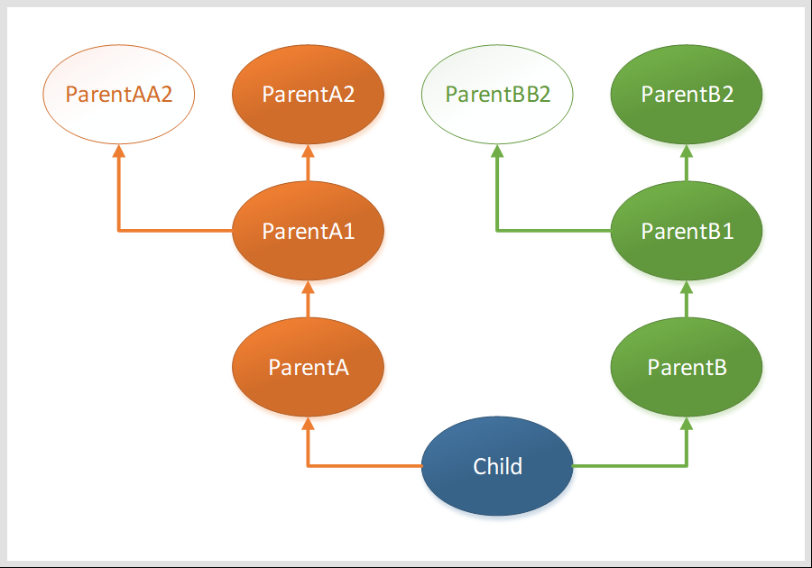

# 对象切片的构造与析构法则

*本文对 C++ 多继承涉及到的构造、析构、切片等原理进行了剖析。*


## 准备



注：上图不能表明多继承时的 ***左右顺序*** ，因此对于涉及到多继承的类，单独用代码描述如下：

- public class `Child` : public `ParentA` , public `ParentB` ;
- Public class `ParentA1` : public `ParentAA2` , public `ParentA2` ;
- public class `ParentB1` : public `ParentBB2` , public `ParentB2` ;

 根据改图可以看到，存在多棵继承树，每棵树 ***从上到下*** 描述为：

- ParentAA2, ParentA1, ParentA, Child
- ParentA2, ParentA1, ParentA, Child
- ParentBB2, ParentB1, ParentB, Child
- ParentB2, ParentB1, ParentB, Child


## 构造与析构的顺序

有如下代码：

```cpp
Child* c = new Child();
delete c;
```

> 构造顺序原则：

- 先构造该对象的继承树，如果有多棵树，则按照类声明的顺序，***从左到右*** 依次构造每一棵继承树；
- 对于一棵继承树，总是从从树顶开始，依次向下完成构造，即 ***从上到下*** ；

> 构造顺序剖析（从上到下的顺序，其中代码引用的部分表明实际发生了构造行为）：

- 构造 Child 之前，发现 Child 有两棵继承树，从左到右是 ParentA 和 ParentB 
- 所以先构造 ParentA 这棵树
- 构造 ParentA 这棵树时，向上攀爬依次找到 ParentA 、ParentA1
- 发现 ParentA1 有两棵继承树，从左到右是 ParentAA2 和 ParentA2
- 所以先构造 ParentAA2 这棵树，再构造 ParentA2 这棵树
- ParentAA2 已经是树顶，所以有：`ParentAA2()`
- ParentA2 已经是树顶，所以有：`ParentA2()`
- 向下回到 ParentA1() ，所以有：`ParentA1()`
- 再向下回到 ParentA() ，所以有：`ParentA()`
- 此时再构造 ParentB 这棵树
- 构造 ParentB 这棵树时，向上攀爬依次找到 ParentB 、ParentB1
- 发现 ParentB1 有两棵继承树，从左到右是 ParentBB2 和 ParentB2
- 所以先构造 ParentBB2 这棵树，再构造 ParentB2 这棵树
- ParentBB2 已经是树顶，所以有：`ParentBB2()`
- ParentB2 已经是树顶，所以有：`ParentB2()`
- 向下回到 ParentB1，所以有：`ParentB1()`
- 再向下回到 ParentB，所以有：`ParentB()`
- 此时 Child 的两棵继承树已经构造完毕
- 因此该构造 Child ，所以有：`Child()`

> 析构顺序原则：

- 系统以 ***当前所析构的对象*** 为基准，按照 ***与构造时相反*** 的顺序依次进行；
- 也就是说，系统所析构的内容只包括 ***该对象及对象上方的所有继承树*** ，而不包括该对象下方的所有继承树；

> 析构顺序剖析：

- 与构造的顺序完全相反即可；


## 切片

按照面向对象的切片规则，Child 对象是可以被其继承树 ***上方*** 的任何一个类型接收的，即可以有如下代码：

```cpp
ParentXX* ps = new Child();
```

其中 `ParentXX` 具体类型可以是：

- ParentA, ParentA1, ParentA2, ParentAA2
- ParentB, ParentB1, ParentB2, ParentBB2

> - 按照切片规则，此时 `ParentXX` 所保留的信息只是实际对象的一个子集，并不是全部；
> - 后续开始讲解，直接 ***析构*** 一个切片时，实际会发生什么

```cpp
delete ps;
```


## 切片的析构

> 原则

- 切片本身也是一个对象，虽其并未包含真实的内存对象的全部
- 因此，直接析构一个切片时，仍然遵循上述总结的析构顺序
- 也就是说，系统仍然会以当前切片为基准，将该 ***切片及切片上方的继承树*** 析构完毕
- 但是，该 ***切片之下*** 的部分，将无法被析构

> 问题

- 由此可见，如果析构的是真实对象本身，则一切运转正常
- 但如果对象仅仅被一个切片的形式析构，必然造成内存泄露或者内存错误

> 解决

- 无论是析构切片，还是析构真实对象本身，解决目标是：让系统定位到要析构的那个 ***真实对象*** ，而不是只定位到某个切片；
- 所以，这就是 `virtual` 析构器的魅力；


## virtual 析构器

> virtual 析构器的作用：

- 用 `virtual` 来修饰一个对象/切片的析构器时，可改变系统的析构行为：
    - 从该对象/切片 ***向下*** 追溯并定位到真实的那个内存对象
    - 然后以这个真实的内存对象为基准，来开始进行析构
    - 也就是说，这样的析构过程才是正确且干净的
- 举例：我们直接 `delete` 切片 `ParentAA2` ：
    - 则只要 `ParentAA2` 的析构器使用了 `virtual` 修饰，系统就能够从 `ParentAA2` ***向下*** 回溯，定位到真实的内存对象，即 `Child` 对象
    - 然后按照前面所讲解的析构顺序，开始 `Child` 对象的析构过程

> virtual 析构器的彩蛋：

- 同一棵继承树上，并非所有切片都需要 `virtual` 修饰：
    - 在上面的多继承树示意图里，从 `Child` 对象开始，可以有很多切片
    - 但并非每个切片类型的析构器都必须用 `virtual` 修饰
    - 我们只需保证：被 `delete` 的切片及该切片 ***上方*** 的继承树里，有 ***至少一个*** 节点的析构器使用了 `virtual` 修饰
    - 则在 `delete` 该切片时，系统就能够 ***向下*** 回溯并定位到真实的 `Child` 对象，从而进行正确且干净的析构
- 举例：我们直接 `delete` 切片 `ParentA` ：
    - `ParentA` 没有使用 `virtual` 修饰
    - `ParentA` 上方的继承树里，只有 `ParentAA2` 的析构器使用了 `virtual` 修饰
    - 则 `delete ParentA` 时，系统仍然能够定位到真实的 `Child` 对象完成析构

> virtual 析构器的陷阱：

- 对于上面描述的彩蛋，在不交叉的继承树之间不适用：
    - 在上面的多继承树示意图里，虽然能够数出多棵继承树，但有的继承树之间是不交叉的
    - 例如，`ParentA1` 与 `ParentB1` 这两个节点所属的继承树是相互独立的
    - 所以，彩蛋只适用于同一棵继承树
- 举例：我们直接 `delete` 切片 `ParentB` ：
    - 整个多继承树示意图里，只有 `ParentAA2` 的析构器使用了 `virtual` 修饰
    - `ParentB` 上方的继承树里，找不到任何一个 `virtual` 修饰的析构器
    - 因为 `ParentAA2` 与 `ParentB` 不在同一棵继承树上
    - 则 `delete ParentB` 时，系统将只能基于 `ParentB` 这个切片来析构，将产生内存问题


## 总结

- 用 `virtual` 修饰析构器应当成为一种编程习惯
- C++ 的默认析构器（即不显式定义析构器）是没有 `virtual` 修饰的
- 在 `delete` 一个切片时，可能的情况下，最安全的做法是：
    - 先将该切片转换为真实的内存对象类型，然后再析构该真实内存对象类型
    - 而不是直接析构该切片，以防切片及切片上方的继承树中没有 `virtual` 析构器
- 关于 `interface` 切片要注意：
    - C++ 只有 `class` 的概念，而所谓的 `interface` 其实只是将 `class` 里的方法都修饰为纯虚函数，因此 `interface` 本身也是一个类
    - 但 `interface` 除了对方法进行纯虚抽象之外，「干净整洁」也是价值之一，所以很难容忍在 `interface` 中增加一个空的 `virtual`析构器
    - 所以，一定要当心直接 `delete` 该 `interface` 切片类型可能带来的内存问题


## 拓展

既然 `virtual` 析构器这么优秀，为何 C++ 的析构器不默认为 `virtual` 修饰呢？因为 `virtual` 是一个运行时体系，涉及到运行时成本。具体可参考另一篇文章：[从内存模型分析C++的面向对象机制](/C++/学习心得/从内存模型分析C++的面向对象机制)

