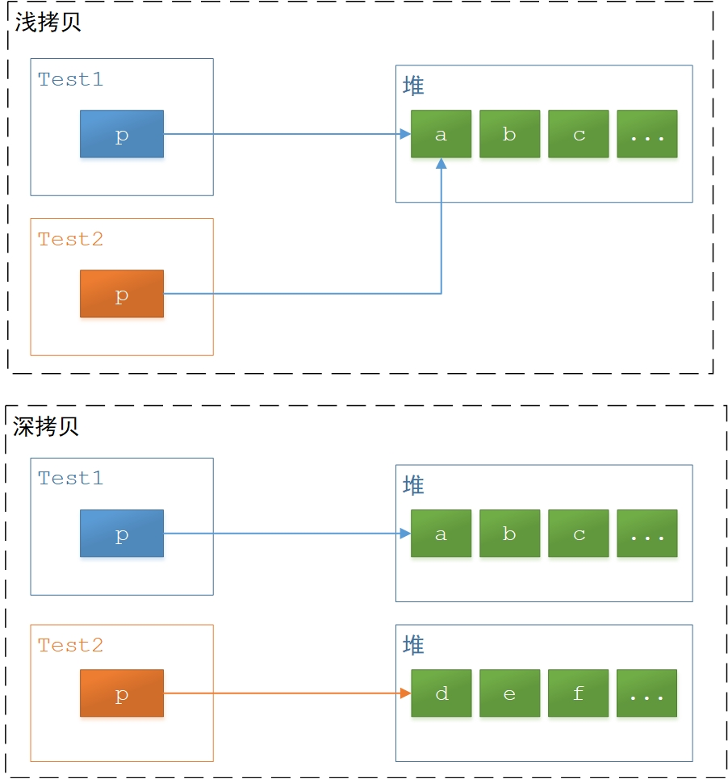

# 拷贝构造函数

## 写在前面

C++ 的参数传递方式：

- 与其它编程语言一样，C++ 的参数传递一般有几种方式：引用传递、按值传递；
- 其中，引用传递是比较明确的，就是 `&` 引用的传递；
- 但是，按值传递场景就比较多，例如：变量可以直接按值传递，指针值也是按值传递（因为指针本身其实就是一个 `int` 变量）；
- 而麻烦在于：***C++的对象也可以按值传递*** ，这就是本文要讲解的内容。

> 对于 JAVA 、.NET 来说，对象都是引用传递的，可 C++ 没有这么办，所以，C++ 对象的按值传递就带来了一系列麻烦，语法和规则也变得很麻烦，对应的，编译器为了处理这些麻烦也很辛苦（同情C++编译器）。当然，我们也可以认为，正是看到 C++ 允许对象的按值传递所带来的一系列晦涩和麻烦，后期的 JAVA/.NET 才干脆而直白的取消了该规则，对象一律按照引用传递。

*当然，其实C++对象的按值传递也没那么复杂，规则搞清楚了自然也就豁然开朗。为了豁然开朗，需要后续一步一步的来讲解。*


## 对象的生成步骤

我们知道，一个对象的生成，需要两个步骤：

1. 分配对象的空间，空间包括对象所属类的成员变量，且空间可能在堆上，可能在栈上，取决于分配的语法；
2. 针对该对象空间执行对应的构造函数；

因此，如下代码展示了上述两个步骤：

```cpp
class Test
{
public:
    Test(int p) {}
    int mp = 8;
};

//t1对象在栈上
Test t1(1);

//t2对象在堆上
Test* t2 = new Test(2);
```

根据上述代码，在生成一个对象时，步骤如下：

1. 分配对象空间，大小由 `Test` 类里的成员变量决定；
2. 为对象空间里的成员变量赋值为初始值，例如 `mp` 赋值为 8 ；
3. 基于对象空间，执行构造函数 `Test(int)` ；


## 拷贝构造函数的产生

基于前面的内容，现在考虑一种情况：构造函数的参数是对应类型的对象，即：

```cpp
class Test
{
public:
    Test(Test& pt) {}
};
```

问题就是结论：

- 所谓拷贝构造函数，就是 ***构造器的参数是对应类型的对象*** ；
- 但实际情况没这么简单，还有很多限制，也有很多种情况，后续会逐步说明；

该部分内容主要讲 「拷贝构造函数的产生」，因此，看哪些情况下会使用到拷贝构造函数：

1. 将对象作为函数的参数，例如 `void f(Test pt)` 
2. 将对象作为函数的返回值，例如 `Test f()` 
3. 将对象直接赋值给另一个对象，例如 `Test t2=t1` 

上述就是可能导致拷贝构造函数被触发的所有情况。为了理解拷贝构造函数，还需提前说明几点：

1. 将对象作为函数的参数，此处包括 ***构造函数、以及构造函数之外的函数*** 
2. 拷贝构造函数只发生于将 ***对象按值传递*** 的时候

所以，下面几种情况都不会触发拷贝构造函数：

- `void f(Test& pt)` ，此时对象不是按值传递，不会触发拷贝构造函数；
- `Test& f() { return Test(); }` ，此时返回的是对象的引用，不会触发拷贝构造函数；

结合前面所讲的对象的生成步骤，总结一下拷贝构造函数被触发时的行为：

1. 分配对象空间，大小由对应类里的成员变量决定；
2. 为对象空间里的成员变量赋值为初始值；
3. 基于对象空间，执行拷贝构造函数；


## 浅拷贝 & 深拷贝

*这部分内容依然是铺垫。*

***浅拷贝*** ：

- 就是将对象的空间按字节位进行拷贝
- 此时，假设对象中的某个成员变量是一个指针，则浅拷贝后，两个指针值是一样的，都指向同一个地址

***深拷贝*** ：

- 就是自行处理对象空间中各个成员变量的内容
- 例如，分配新的内存空间并让成员变量指针指向新地址，并为分配的新内存赋值等

浅拷贝和深拷贝的示意图如下：



需要说明的是：

- 浅拷贝和深拷贝并无所谓好和坏，取决于具体的程序需求
- 只要程序员清楚二者的区别，并确保拷贝后的新对象空间的值是自己预期的即可


## 拷贝构造函数的原型

### 原型

拷贝构造函数原型如下：

```cpp
Test(Test&);
Test(const Test&);
```

编译器的匹配举例如下：

```cpp
//此时匹配的就是Test(Test&)
Test t1;
Test t2(t1);

//此时匹配的就是Test(const Test&)
const Test t1;
Test t2(t1);
```

所以，其实拷贝构造函数的原型一个就够了：

- 即 `const Test&` 
- 因为即使非 `const` 的变量，也可以被 `const` 的参数所接收

```cpp
Test(const Test&);
```


### 原型拓展：默认参数

> 原型拓展

由于 ***默认参数*** 的存在，所以其实下列原型也都是拷贝构造函数：

```cpp
Test(Test&);
Test(Test&, int a=1);
Test(const Test&);
Test(const Test&, int a=1, int b=2);
```

> 总结一下

对于一个类 `Test` ，只要满足下述条件，该构造函数就是拷贝构造函数：

1. 构造函数的第一个参数是下列之一：
    - `Test&`
    - `const Test&`
    - `volatile Test&`
    - `const volatile Test&`
2. 构造函数没有其它参数，或者其它参数都有默认值

> 举一反三

下列都不是拷贝构造函数，只是普通的构造函数，只是这些构造函数的参数存在对象的引用：

```cpp
Test(Test&, int a);
Test(const Test&, int a=1, int b);
Test(int a, const Test&);
```

> 举一反四

虽然下面的每一个都是拷贝构造函数，但是同时定义在一个类中时，是编译不过去的，因为同时存在多个可匹配的构造函数（道理大家都懂，此处只是顺便多说一句）：

```cpp
Test(Test&);
Test(Test&, int a=1);
```


### 原型拓展：为何必须是 `&`

拷贝构造函数的参数为什么必须用 `&` 引用，也就是说，为什么不能使用下列原型：

```cpp
Test(Test);
Test(const Test);
```

对于这个问题，我们可以先假设拷贝构造函数的参数不使用&引用，然后来推演看看会发生什么结果：

1. 当需要将对象按值传递时，就会触发拷贝构造函数（参见前面讲的会触发拷贝构造函数的几种情况）；
2. 而拷贝构造函数的目的，就是根据按值传递的对象 1 ，来创建出新的对象 2 ；
3. 因此，为了达到按值传递的目的，会有一个自动触发拷贝构造函数来创建新对象的行为；
4. 而拷贝构造函数本身也是函数，该函数的参数也是一个按值传递的对象；
5. 那么，该参数如何生成呢，仍然是只能继续触发拷贝构造函数来生成；
6. 所以，此时就死循环了，当然，专业术语叫「***无限递归***」；
7. 所以，***必须规定，拷贝构造函数的对象参数是 `&` 引用*** ；

根据上述解释，我们承认也接受了这个事实：

- 对象参数使用 `&` 引用，才是拷贝构造函数；
- 而不使用 `&` 引用时，就不是拷贝构造函数，而只是普通的构造函数；

所以，我们就定义一系列普通的构造函数：

```cpp
Test(Test t);
Test(Test t, int a=1);
Test(Test t, int a=1, int b=2);
```

对于上面的普通构造函数，我们直觉理解的编译过程是：

1. 编译器发现普通构造函数 `Test(Test t)` ;
2. 该构造函数存在参数 `t` ，该参数是一个按值传递的对象；
3. 因此，触发拷贝构造函数，来创建参数 `t` ；

然而事实是：***编译器仍然报错，不允许这样的原型*** 。原因是：

1. 拷贝构造函数是 `Test(Test& t)` ;
2. 而此时发现存在一个普通构造函数 `Test(Test t)` ;
3. 那么，根据函数重载的原理，此时编译器是无法知道究竟该匹配哪一个构造函数的；
4. 当然，**这只是一个比较民间但易理解的解释**，因为编译器的错误提示并不是这样的；
5. 所以我确实不明白，为什么编译器不使用我这个解释，当然，我相信是因为我没有理解透彻；


### 原型拓展：非 `&` 的例外

现在我们明白了几点：

1. 拷贝构函数的对象参数必须使用 `&` 引用；
2. 需要将对象按值传递时，就会自动触发拷贝构造函数，来创建新的对象；
3. 即使是普通的构造函数，如果参数涉及按值传递的对象，也会触发拷贝构造函数；

所以，下面就是普通构造函数触发拷贝构造函数的例子：

```cpp
Test(Test t, int a, int b);
Test(int a, Test t);
```

对于这个例子，执行过程如下：

1. 准备该普通构造函数的参数；
2. 发现按值传递的对象 `t` ；
3. 触发拷贝构造函数 `Test(const Test&)` ；
4. 创建临时对象 `t` ；
5. 运行该普通构造函数；
6. 释放临时对象 `t` ；


### 默认拷贝构造函数

编译器会生成 ***默认的拷贝构造函数*** ，规则如下：

1. 默认拷贝构造函数原型是 `Test(const Test&)` 或 `Test(Test&)` ，根据上下文决定；
2. 默认拷贝构造函数的实现方式是：***浅拷贝*** ；
3. 只要 ***显式*** 声明过任意一个拷贝构造函数，则编译器就不会再生成默认拷贝构造函数；


## 拷贝构造函数的几种情况

> 下面是触发拷贝构造函数的几种情况分析，要清晰的看到整个过程，建议直接编写代码，分别在拷贝构造函数中、析构函数中都打印输出信息，本文中不想贴上大量的测试代码，因为这会影响文章版面的精美。


### 函数参数

包括普通函数、构造函数，例如：

```cpp
void func(Test t) { ... }

Test t1;
func(t1);
```

则执行过程如下：

1. 触发拷贝构造函数，根据 `t1` 对象创建临时对象 `t` ；
2. 将该临时对象 `t` 作为 `func` 函数的参数；
3. 执行 `func` 函数；
4. `func` 函数执行完毕，自动析构临时对象 `t` ；


### 函数返回

例如：

```cpp
Test func()
{
    Test t1;
    return t1; 
}

func();
Test t2 = func();
```

则执行过程如下：

1. 执行 `func()` ；
2. 创建 `t1` 对象，该对象的创建是通过普通构造函数 `Test()` ；
3. 触发拷贝构造函数，根据 `t1` 对象创建临时对象 `t` ；
4. 将临时对象 `t` 返回；
5. `func()` 执行完毕，`t1` 自动被析构；

需要注意的是：

- 如果没有使用变量来接收返回值，即 `func()` ，那么，返回值就是临时对象 `t` ，且 `func()` 执行完后，该临时对象就立即被析构了；
- 如果使用了变量接收返回值，即 `Test t2 = func()` ，那么，`t2` 就是这个临时对象 `t` ，也就是说，并不会再次触发拷贝构造函数，来根据 `t` 创建对象 `t2` ；而此时 `t2` 的析构取决于具体的程序；

值得讨论的是 `t1` 和 `t` 的生存周期：

- `t1` 是在 `func()` 函数体内显式创建的，且 `t1` 的生存周期也仅局限于 `func()` 函数体内，因此在 `func()` 执行完毕后，`t1` 也就自动被析构了；
- `t` 是根据 `t1` ，通过拷贝构造函数创建的，其生存周期取决于具体的接收者


### 对象赋值

例如：

```cpp
Test t1;
Test t2 = t1;
```

则执行过程如下：

1. 创建 `t1` 对象，该对象的创建是通过普通构造函数 `Test()` ；
2. 触发拷贝构造函数，根据 `t1` 对象创建 `t2` 对象；

对象的 ***直接赋值*** 其实和 ***直接调用拷贝构造函数*** 是等价的：

```cpp
Test t1;
Test t2(t1);
```


## 向 JAVA / .NET 看齐

>在 JAVA / .NET 语法中，对象统一都是引用传递，因此不存在对象按值传递的问题。且个人认为，C++ 对象的按值传递实在不值得推崇。当然，推崇或不推崇，语法功能就摆在那里。

但其实，对于 C++ 来说，也可以通过一些技巧来屏蔽对象的按值传递功能：

1. 针对某个类，使得该类的对象不可以按值传递；
2. 所谓的屏蔽，是当开发者打算按值传递时，发生编译错误；

方法是：

- 在类中声明拷贝构造函数，但是不要实现它；
- 如果实在需要实现拷贝构造函数，就将它定义为 `private` ，例如工厂模式时；

例如：

```cpp {5,7}
class Test
{
public:
    //声明但不实现
	Test(Test& t);
    //声明但不实现
	Test(const Test& t);
	//...
};
```

又如：

```cpp {5,8}
class Test
{
public:
    //声明但不实现
	Test(Test& t);
private:
    //声明且实现，但定义为 private
	Test(const Test& t) { ... }
public:
    //...
};
```


## 总结

- C++ 允许对象的按值传递；
- 按值传递有几种情况：
    - 对象作为函数参数
    - 对象作为函数返回
    - 对象直接赋值
- 按值传递时，会根据对象 `a` 创建新对象 `b` ，步骤是：
    1. 分配新对象 `b` 的空间
    2. 然后在新对象 `b` 的空间上执行构造函数
    3. 而执行的这个构造函数就是拷贝构造函数
- 拷贝构造函数的原型：
    - 第一个参数是对象类型的 `const` / 非 `const` 的引用
    - 除此之外，没有其它参数，或其它参数都有默认值
- 只要 ***显式*** 声明过拷贝构造函数，编译器就不会再生成默认拷贝构造函数；
- 默认拷贝构造函数的实现方式是 ***浅拷贝*** ；

