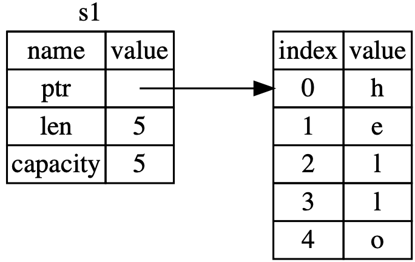
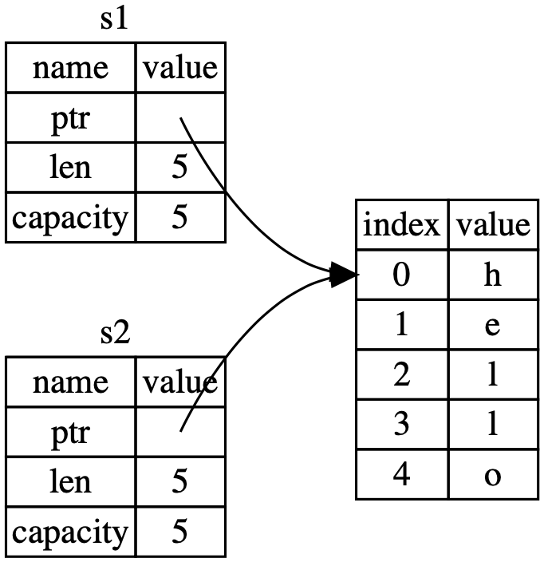
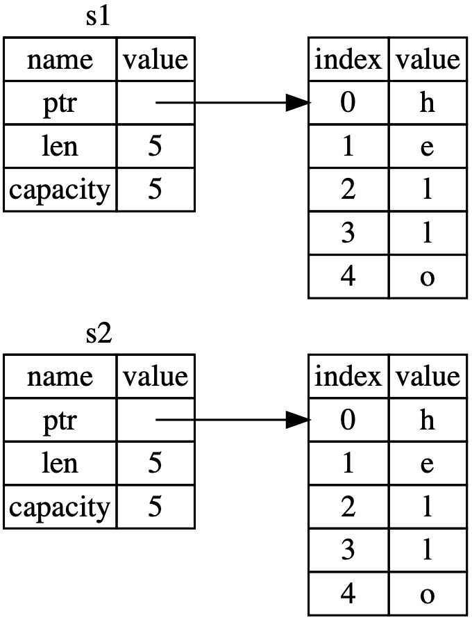

# 4.1. 什么是所有权

OwnerShip是Rust独有的一个特性，它保证了内存的安全而不必使用GC。本章讨论OwnerShip以及相关联的一些特性：Borrow，Slice，以及Rust数据在内存中的排布。

### 关于内存管理

- 所有程序在运行时都需要管理内存的使用
- 有的语言使用GC，有的语言则需要程序员手动显式的分配和释放内存
- Rust则使用Ownership机制
- Ownership机制包含一系列规则，由编译器在编译期间进行检查，因此在程序运行时，该机制不会降低运行效率

### Stack & Heap

说明：
- 大多数编程语言不用考虑stack和heap
- 但对于系统级的语言来说，例如Rust，数据在stack或heap会影响到语言的行为，因此程序员需要对其做出明确的决定
- stack和heap都是程序运行时可使用的内存，但他们有所不同

Statck：
- 后进先出方式
- stack效率高的原因是：
    1. 不需要查找位置来放入数据或取得数据，因为位置总是在顶部
    2. stack中的数据必须有已知的、确定的大小

Heap：
- 对于编译器无法确定大小的数据，或者大小可变的数据，就使用heap来存储
- 在heap上存储数据的过程，就是操作系统寻找合适的内存并告知该内存pointer的过程，叫做allocating
- 但是在stack放入数据的过程不能叫做allocating
- 由于pointer是已知的确定的大小，所以可以将pointer放入stack，在需要实际的数据时，在根据该pointer去获取
- 访问heap的数据比stack要慢，因为需要根据pointer去找到数据，另外，在heap上分配很大的内存也是耗时的

调用函数时：
- 调用函数时，相关的数据被压入stack
- 函数运行结束后，相关的数据又被弹出stack
- 这些数据包括：
    1. 传递给函数的数据，可能包括指向heap内存的pointer
    2. 函数内的local变量

### Ownership规则

1. Rust中的每个数据都一个对应的变量，这个变量就是数据的owner
2. 任何时候该数据只能有一个owner
3. owner离开对应的scope之后，数据就被销毁

### Variable Scope

- scope就是程序中的某个区域，在该区域内，某个元素有效
- 变量从声明的位置开始，到对应的scope结束，在该范围内有效

举例：
```rust
{
    let s = "number";
    //other code
}
```
剖析：
1. 通过{}形成了一个scope
2. 变量s从声明开始就是有效的，知道离开该scope

### The String Type

说明：
- 为了描述ownership的规则，需要借助String这个更复杂的数据类型
- 之前的内容里，涉及到该数据类型时，数据内容都是存储在stack上
- 现在需要考虑该数据在heap上的情况，并来看Rust是如何知道该数据何时应该被清理
- 后续使用String作为例子并重点介绍String与ownership的关系

string & String：
- 程序中有些硬编码的字符串，例如 let s = "abc";它们是string
- 硬编码的字符串很方便，但并不适用于所有需要文本的场景
    1. 例如，它不是可mut的
    2. 又如，具体的字符串内容，在编译时无法知道，只有运行时才能知道，例如等待用户输入
- 硬编码的string在编译期就明确的知道内容，所以直接包含在可执行程序中，这也是为何硬编码string快速而高效的原因，但这是建立在string非mut的基础之上
- 但是我们无法在编译期把一些无法确定大小或者大小可变的字符串内存包含在二进制文件中
- 所以，有 String 这种类型，内存分配在heap上，且字符内容可变
- String在Chapter8详细讲解

举例：硬编码的string
```rust
let s = "hello";
```

举例：内容可变的String
```rust
// create a String from a string literal using the from function
let mut s = String::from("hello");
// push_str() appends a literal to a String
s.push_str(", world!");
// This will print `hello, world!`
println!("{}", s);
```

### Memory & Allocation

对于String来说：
- 为了支持mut
- 也为了支持字符串内容可变
- 因此需要在heap上分配内存，且该内存在编译期无法确定

所以 String 意味着：
1. 内存必须在运行时通过操作系统获取
> 对于这一点来说，在调用String::from的时候，就向操作系统申请一片内存，很多语言普遍都是这种行为
2. 在String使用完毕后，需要一个机制来归还内存给操作系统
> 这一点与其它语言是不一样的，例如GC，需要随时保持跟踪和清理那些不再使用的内存，但Rust不是这样的机制

Rust机制举例：
```rust
{
    // s is valid from this point forward
    let s = String::from("hello");

    // do stuff with s
}
// this scope is now over, and s is no longer valid
```
例子剖析：
1. Rust的机制是：变量离开scope后，所属于该变量的内存就自动归还
2. 在该例子中，当变量 s 离开scope后，Rust自动调用 drop 方法
3. 在 drop 方法中，String对应的实现就是释放内存
4. 这种模式对Rust的代码编写有着深远的影响
5. 这个例子看起来比较简单，但是还有更复杂的情况，比如多个变量都需要使用我们在heap上分配的内存数据时，因此后续会继续讲解这些更复杂的情况
> Rust的这种模式，类似C++的RAII机制

### 变量和数据的交互：Move

在Rust中，有多种方式来实现多个变量与同一份数据的交互，先看一个例子：
```rust
let x = 5;
let y = x;
```
例子剖析：
- 将 5 绑定给变量 x
- 拷贝 x 的内容并绑定给变量 y
- 因此有两个变量， x 和 y，且两个变量的值都是 5
- 这两个变量都在 stack
- 该过程能够这样执行的原因是，int 类型的大小已知和确定的

再看另一个 String 的例子：
```rust
let s1 = String::from("hello");
let s2 = s1;
```

为了说明这个例子，需要先剖析 String 实际上包含了些什么：
1. 一个 pointer 变量，指向存储 string 内容的内存
2. 一个 length 变量
3. 一个 capacity 变量

上述 String 的三个变量存储在 stack ，如下图所示：


因此，将 s1 赋值给 s2 的时候，String 的如下内容被拷贝到 stack：
- pointer
- length
- capacity

也就是说，pointer 所指向的 heap 中的数据并没有被拷贝，如下图：


所以，这并不是我们预想中的样子，我们预想中希望 heap 的数据也可以拷贝，但这样的话，s2 = s1 这个操作就会影响运行时的程序性能，尤其是当 heap 中的数据比较大的时候，因此Rust不会这样做，如下图：



那么，按照之前的讨论，变量离开 scope 之后，对应的内存就会被释放：
- 变量 s1 和 s2 离开了 scope
- 它们的内存都被释放
- 但是 s1 和 s2 的 pointer 都指向了 heap 中同一片内存
- 所以 heap 中这片内存就被释放了两次
- 这可能带来内存错误，或者带来安全漏洞

因此，这就是 Rust 的处理机制：
1. 将 s1 赋值给 s2
2. Rust 只拷贝了 pointer/length/capacity
3. 但不拷贝 pointer 所指向的 heap 中的内存
4. 对应的，Rust认为此时 s1 已经无效，只有 s2 是有效的
5. 因此，当 s1 离开 scope 后，Rust 不需要做任何事情
6. 只有当 s2 离开 scope 后，Rust才会自动释放 s2 所关联的内存

也就是说，这就是Rust的 Move 机制：
1. 将 s1 赋值给 s2
2. Rust 进行浅拷贝而不是深拷贝
3. 即：将 s1 move 给 s2，并将 s1 标记为无效
4. 所以，Rust通过这样的行为，确保了不降低程序运行时的性能

该 Move 机制如下图所示：


用下面的例子印证一下，将 s1 赋值给 s2 以后，s1 已经无效，不能再使用，所以编译器报错，告知 s1 已经被 move 给 s2 ：
```rust
let s1 = String::from("this is s1");
let s2 = s1;

println!("{}", s1);
```

### 变量和数据的交互：Clone

如果我们确实需要深拷贝，那么就要使用 clone 方法，例如：
```rust
let s1 = String::from("hello");
let s2 = s1.clone();

println!("{}, {}", s1, s2);
```

上面的例子就实现了 String 的深拷贝，此时 s1 仍然是有效的，但要注意，这些深拷贝的操作可能会是耗时的。

#### 变量和数据的交互：Copy

先看一个例子：
```rust
let x = 5;
let y = x;

println!("{}, {}", x, y);
```
例子剖析：
- 这段代码编译和运行都正常，即使没有调用 clone 方法，x 仍然是有效的，并没有被 move 给 y
- 这是因为这些数据类型的大小在编译期都是确定的，而且都是完全存储在 stack 的
- 所以对于这些数据类型来说，浅拷贝和深拷贝的效果是一样的，进而也没有必要调用 clone 方法

这就是Rust的 Copy 特性：
1. 可以为存储在 stack 的数据类型声明 Copy 特性
2. 如果一个数据类型有 Copy 特性，那么将老的变量赋值给新的变量以后，老的变量仍然是可用的
3. 如果一个数据类型或者该数据类型的任何一个部分声明了 Drop 特性，那么就不允许为该数据类型再声明 Copy 特性，否则会引起编译器报错

具备 Copy 特性的数据类型规则：
- 简单的 Scalar 类型及组合
- 不需要内存分配或资源请求的类型

下面是一些具备 Copy 特性的数据类型：
1. Scalar类型：整型，浮点，布尔，字符
2. 所有元素都是 Copy 特性的Tuple，例如：
    - (i32, i32) 是 Copy 特性
    - (i32, String) 不是 Copy 特性

### Ownership & Function

函数对 ownership 的影响总结为：
1. 传递一个值给函数，类似于绑定一个值给变量
2. 传递一个变量给函数，则取决于变量的类型，可能 Move，可能 Copy
3. 函数的返回值也取决于数据类型，可能 Move，可能 Copy

下面的例子通过注释详细说明了这些规则：
```rust
// Copy参数
fn makes_copy(some_integer: i32) {
    println!("{}", some_integer);
}

// Move参数
fn takes_ownership(some_string: String) {
    println!("{}", some_string);
}

// Move返回值
fn gives_ownership() -> String {
    let some_string = String::from("hello");
    some_string
}

// Move参数之后，Move返回值
fn takes_and_gives_back(a_string: String) -> String {
    a_string
}

fn main() {

    /*
    变量 x 被 Copy 给函数，
    函数的调用不会导致 x 无效
    */
    let x = 5;
    makes_copy(x);
    
    /*
    变量 s 被 Move 给函数，
    函数调用后 s 无效
    */
    let s = String::from("hello");
    takes_ownership(s);
    
    /*
    函数创建了一个 String 变量，
    然后由变量 s1 接管其 Ownership 
    */
    let s1 = gives_ownership();
    
    /*
    变量 s2 被 Move 给函数，
    然后被 s3 接管 Ownership
    */
    let s2 = String::from("hello");
    let s3 = takes_and_gives_back(s2);
    
}
```

函数可以通过 tuple 返回多个值：
```rust
fn calculate_length(s: String) -> (String, usize) {
    let length = s.len();
    (s, length)
}

fn main() {
    let s1 = String::from("hello");

    let (s2, len) = calculate_length(s1);

    println!("The length of '{}' is {}.", s2, len);
}
```

拓展：
1. 有时候我们希望函数使用一个变量但不要接管 ownship
2. 例如一个变量传递给函数，函数执行之后我们还需要使用该变量
3. 而重复的将参数 Move 给函数，然后函数又通过返回值 Move 出来太过繁琐
4. 这就是后续要讲解的另一个特性，叫做 reference
