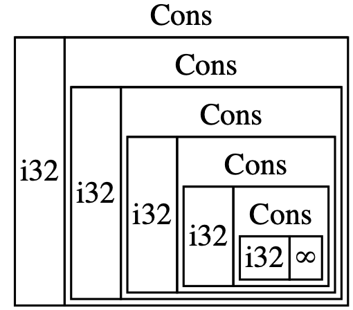
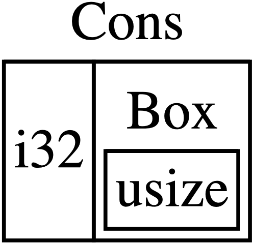

# 15.1. 使用 ***Box***

关于 ***box*** ：

- 它是最简单直观的智能指针
- 对应的类型是 `Box<T>`
- 它允许将数据存储在 heap 中而不是 stack 中
- 当然，这个智能指针本身是存储在 stack 中，然后它指向 heap 中的数据
- 除了将数据存储在 heap 而不是 stack 之外，它不会带来额外的性能损失；但同时，它也不再具备其它能力


使用 ***box*** 的场景：


> 对大量数据进行所有权转移时，不希望这些数据被拷贝

- 对大量数据进行所有权转移时，会耗费很多时间来拷贝到 stack
- 改进的办法是，使用 box 将这些数据存储在 heap 中
- 从而在转移所有权时，只有对应的少量指针会被拷贝到 stack ，而所指向的数据仍然在 heap 中


> 无法在编译时知道某种数据类型的大小，但是在某种场景下，要访问该数据类型的值时，却需要知道该类型的精确大小

- 后续关于「Recursive Type」的章节中会讲解这种场景


> 在 own 某个数据时，只关心这种数据类型实现了某些 trait ，而不关心具体是哪一种数据类型

- Chapter17 一整章都是讲解这种场景


## 存储数据到 Heap

先看 `Box<T>` 的语法及如何访问存储在里面的值：

```rust
fn main() {
    let b = Box::new(8);
    println!("b = {}", b);
}
```

数据关系：

1. 变量 b 的值是一个 box 
2. 该 box 指向数据 8 
3. 而 8 这个数据存储在 heap 中

例子剖析：

- 该例子打印结果是 `b = 8`
- 也就是说，可以直接访问 box 中的数据，就像该数据是存储在 stack 中一样

数据销毁机制：

- 与 own 机制一样，当 box 离开生存范围时，该 box 就会被销毁
- 在该例子中，b 离开 `main` 之后，b 就会被销毁
- 销毁的内容包括：第一，box 本身，也就是变量 b ，存储在 stack 中；第二，box 也就是 b 所指向的数据，存储在 heap 中

补充：

1. 该例子将一个简单数据类型存储在 box 中，这仅仅只是为了演示，因为这种做法没有意义
2. 对于像 `i32` 这种简单数据类型，更合适的方式是让它默认存储在 stack 中
3. 后续会展示一些更有用的场景，可以看到只有通过 box 才能定义一些数据类型，而不使用 box 就无法做到


## 使用 Recursive Type

什么是 Recursive Type：

- 即递归类型
- 例如，某个类型中包含多份值，其中某份值又是同样的该类型
- 先用 *cons list* 来举例说明

什么是 *cons list* ：

- 函数式编程语言中常见的类型，来源于 Lisp
- 在 Lisp 中，通过 `cons` 函数（即 construct function）来构造一个新的列表，而这两个参数分别是一个单独的值和另一个旧的列表
- `cons` 函数表达了一种很常见的函数式编程术语：「将 x 与 y 连接」，其中，x 是一个元素，y 是一个列表，连接得到新的列表，x 在该新列表的开头
- 在 *cons list* 中，每一项都包含两个元素，即当前值和下一项，如果下一项的值是 `Nil` 则表示结束
- 注意，此处的 `Nil` 是一种代表终止条件的规范名称，与 `null` 是不同的

注意：

- 虽然函数式编程语言中经常使用 `cons list` ，但在 rust 中并不常见
- 此处使用 `cons list` 只是为了表达递归类型
- 在 rust 中，要使用列表时，最好的选择是 `Vec<T>`


### 举例：rust 计算类型大小

说明：

- rust 在编译时，需要计算类型所占用的空间大小
- 此处先看一个简单的非递归类型，看看 rust 如何计算类型的大小

类型代码：

```rust
enum Message {
    Quit,
    Move { x: i32, y: i32 },
    Write(String),
    ChangeColor(i32, i32, i32),
}
```

计算规则：

- 该类型是一个 `enum` 类型
- `Quit` 不需要占用空间
- `Move` 需要占用两个 `i32` 的空间
- 以此类推
- 因此，占用空间最大的那个成员，决定了 `Message` 所占用的空间大小


### 递归类型的大小无法计算

下面来定义我们的 `cons list` ：

```rust
enum RList {
  Cons(i32, RList),
  Nil,
}
```

然后使用该 `cons list` ：

```rust
use RList::*;

fn main() {
  let rlist = Cons(1, Cons(2, Cons(3, Nil)));
}
```

编译报错，提示如下：

```shell
error[E0072]: recursive type `RList` has infinite size
```

错误剖析：

- 错误信息告知，`RList` 类型「有无限的大小」，因为 `RList` 的 `Cons` 成员中，又包含了同样的 `RList` 类型
- 也就是说，`RList` 的 `Cons` 成员是一种递归类型
- rust 编译器在计算 `RList` 类型的大小时，看到 `Cons` 成员，发现需要一个 `i32` 空间再加上一个 `RList` 空间
- 接着为了计算 `RList` 空间，又再次从 `Cons` 成员开始，发现需要一个 `i32` 空间再加上一个 `RList` 空间
- 就这样，计算无限进行，也就是无限递归下去，如下图所示： 




### 在递归类型中使用 `Box<T>` 

解决方式：

- `Box<T>` 本质是一种指针，它的空间大小是固定的，不会因为所指向的具体内容而改变
- 因此，解决办法是，在 `Cons` 成员中不要直接存放另一个 `RList` ，而是存放一个 `Box` ，再让这个 `Box` 指向另一个 `RList`
- 这和 C 语言中的单向链表是一个道理，链表中每个元素也会有两份值，一份是当前元素的值，另一份是指向下一个元素的指针；C 语言中指针的空间大小是固定的，对应 rust 中，智能指针 `Box` 的空间大小也是固定的

代码改进：

```rust
enum RList {
  Cons(i32, Box<RList>),
  Nil,
}

use RList::*;

fn main() {
  let rlist = Cons(1, 
  	Box::new(Cons(2,
  		Box::new(Cons(3,
  			Box::new(Nil))))));
}
```

代码剖析：

- 此时 rust 能够计算 `RList` 的空间大小
- `Cons` 成员需要一个 `i32` 空间再加上一个 `Box` 的空间
- `Nil` 成员不需要占用空间
- 因此，`RList` 的空间大小是 `Cons` 成员的大小，即一个 `i32` 空间再加上一个 `Box` 的空间
- 此时 `Cons` 成员的空间大小如下图：




### 后续内容

- `Box<T>` 是一种智能指针，它实现了 `Deref` 这个 trait ，所以 `Box<T>` 可以被当做引用看待
- 当 `Box<T>` 离开作用域时，由于 `Box<T>` 实现了 `Drop` 这个 trait ，因此 `Box<T>` 所指向的堆数据也会被自动清除
- 后续会详细讲解这两个重要的 trait