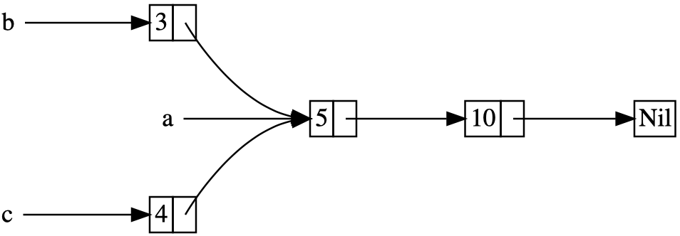
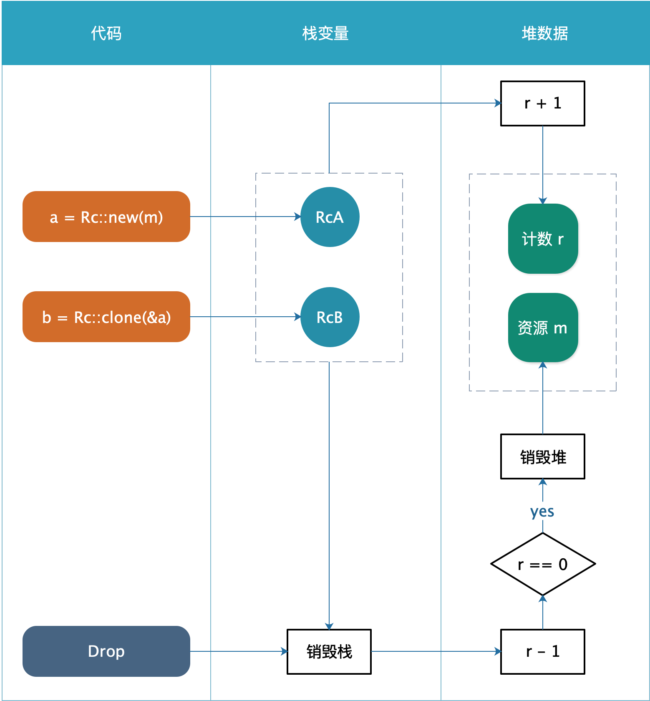

# 15.4. 使用 `Rc` 引用计数

概述：

- 在 rust 中，大多数情况下所有权是明确的，某个值是被哪个变量所拥有
- 但是在某些情况下，某个值可能存在多个所有者
- 例如，「图」这种数据结构，多个边会指向同一个结点；也就是说，这个结点是被多个边所拥有的；因此，只要还有一个边指向这个结点，则这个结点就不应该被清理
- 通俗解释：客厅中有一个人走进来打开电视，而另一个人走进来也可以看电视；在最后一个人离开客厅时，都不应该关闭电视


## 提出问题

场景：

- 继续 15.1. 章节的 ***cons list*** ，在 15.1. 中使用了 `Box<T>` 来解决问题
- 在 15.1. 中，总是根据一个旧的列表来创建一个新的列表
- 但在本章节中，根据一个旧的列表，需要创建两个新的列表，也就是说，新的两个列表共享了旧的列表
- 例如，有列表 a ，内容是 5 和 10；基于 a 加入新值 3 ，得到列表 b ；同时基于 a 加入新值 4 ，得到列表 c ；也就是说，b 和 c 都共享了列表 a
- 该概念如下图所示：




继续使用 15.1. 的 `Box<T>` 来尝试：

```rust
enum RList {
	Cons(i32, Box<RList>),
	Nil,
}

use RList::*;

fn main() {
	let a = Box::new(Cons(5,
            Box::new(Cons(10,
					    Box::new(Nil)))));

	let b = Cons(3, a);
	let c = Cons(4, a);
}
```

则编译错误提示：

```shell
error[E0382]: use of moved value: `a`
let b = Cons(3, a);
                - value moved here
let c = Cons(4, a);
                ^ value used here after move
```

错误剖析：

- 该错误很容易理解，因为 `Cons` 拥有 `Box` 的所有权
- 因此，创建列表 b 时，a 已经被 move 给 b
- 所以，不允许将 a 再次 move 给 c


## 使用 `Rc` 解决

### 原理剖析

`Rc` 概述：

- 使用 `Rc<T>` 来代替 `Box<T>`
- 需使用 `use std::rc::Rc;`
- 创建 `Rc` 的方式是 `Rc::new()`
- 克隆 `Rc` 的方式是 `Rc::clone()`
- 创建和克隆引用时，`Rc` 都会更新引用计数，在计数变为 0 之前，`Rc` 对应的资源都不会被清理

`Rc` 本质：

- 假设资源名称是 m
- 则为 m 创建一个 `Rc` ，该 `Rc` 赋值给变量 a ，叫做 RcA
- 当需要引用资源 m 时，就从 RcA 进行克隆，得到 RcB
- 以此类推，再次需要引用资源 m 时，仍然从 RcA 克隆，得到 RcC
- 此时，产生了如下资源：
    1. 资源 m
    2. 指向 m 的三个 `Rc` 实例：RcA / RcB / RcC
- 则内存原理可以粗糙的理解为：
    1. 资源 m ，存储在堆上
    2. 引用计数 r ，存储在堆上
    3. `Rc` 的三个实例 RcA / RcB / RcC 存储在栈上
    4. 而 RcA / RcB / RcC 这三个实例都指向堆中的 m 和 r

`clone` 本质：

- 无论是 `Rc::new()` 还是 `Rc::clone()` ，都是得到一个新的 `Rc` 实例
- 得到的所有 `Rc` 实例都指向堆中的 r 和 m
- 因此，`clone` 只是创建新的 `Rc` 实例，并更新堆中的引用计数，速度很快，不会花费多少时间

`Drop` 本质：

- `Rc` 实现了 `Drop` 这个 trait
- 根据上述分析，可以知道 `Drop` 的实现原理是：
    1. 将堆中的引用计数 r 减一
    2. 若计数 r 已经减为零，则释放资源 m

- 触发 `Drop` 的方式：
    1. 变量（即 `Rc` 的实例  RcA / RcB / RcC ）离开生存期
    2. 提前调用 `drop(RcA)` 来回收

**万变不离其宗**：

- `Rc` 的实例也是变量，只要是变量，就遵循 rust 系统的 「离开生存周期即销毁」的规则
- 但是，rust 系统只能控制变量自身在栈上的数据，而对于堆上的数据，则需要依赖 `Drop`
- 所以，`Rc` 通过对 `Drop` 和堆的使用，实现了引用计数这种智能指针


### 使用 `Rc`

将上面的例子改成使用 `Rc` ：

```rust
enum RList {
	Cons(i32, Rc<RList>),
	Nil,
}

use RList::*;
use std::rc::Rc;

fn main() {
	let a = Rc::new(Cons(5,
            Rc::new(Cons(10,
					    Rc::new(Nil)))));

	let b = Cons(3, Rc::clone(&a));
	let c = Cons(4, Rc::clone(&a));
}
```

代码剖析：

- 创建 `Rc` 时，使用 `Rc::new()` ，参数传入要引用的资源
- 克隆 `Rc` 时，所克隆的对象是 `Rc` ，且把要克隆的 `Rc` 以引用的方式作为参数传入
- 可以使用 `Rc::clone(&a)` ，也可以使用 `a.clone()` ，但 rust 中更常用的方式是 `Rc::clone(&a)` 


### 查看 `Rc` 计数变化

通过下面的例子来查看计数变化，注释标注了打印结果：

```rust
fn main() {
	let a = Rc::new(Cons(5,
				    Rc::new(Cons(10,
					    Rc::new(Nil)))));
  // 1
	println!("create a, count = {}", Rc::strong_count(&a));

	{
		let b = Cons(3, Rc::clone(&a));
    // 2
		println!("create b, count = {}", Rc::strong_count(&a));
	}
  // 1
	println!("drop b, count = {}", Rc::strong_count(&a));

	let c = Cons(4, Rc::clone(&a));
  // 2
	println!("create c, count = {}", Rc::strong_count(&a));

	drop(c);
  // 1
	println!("drop c, count = {}", Rc::strong_count(&a));

	let d = Rc::clone(&a);
  // 2
	println!("create d, countA = {}", Rc::strong_count(&a));
  // 2
	println!("create d, countD = {}", Rc::strong_count(&d));

	drop(a);
  // 1
	println!("drop a, count = {}", Rc::strong_count(&d));
}
```


## 总结

### 示意图

上面总结的 `Rc` 的本质，可以用下图来进行更清晰直观的展示：




### 后续问题

1. 从本文的分析可以看出，`Rc` 的多个实例都会访问和控制到计数值
2. 而 `Rc` 本身没有进行多线程控制，因此 `Rc` 只能用于单线程场景，Chapter16 讲解多线程时会给出解决办法
3. 同时，`Rc` 实现的只是 **共享读** ，也就说，不允许修改数据
4. 后续会讲解`RefCell<T>` ，结合 `Rc<T>` 的使用，来处理不可变性的控制，并实现数据修改