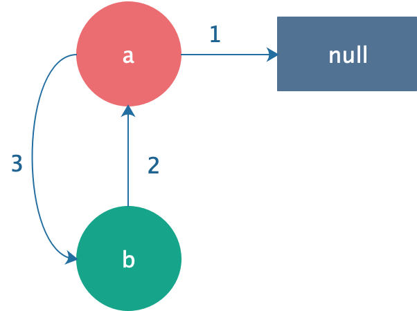
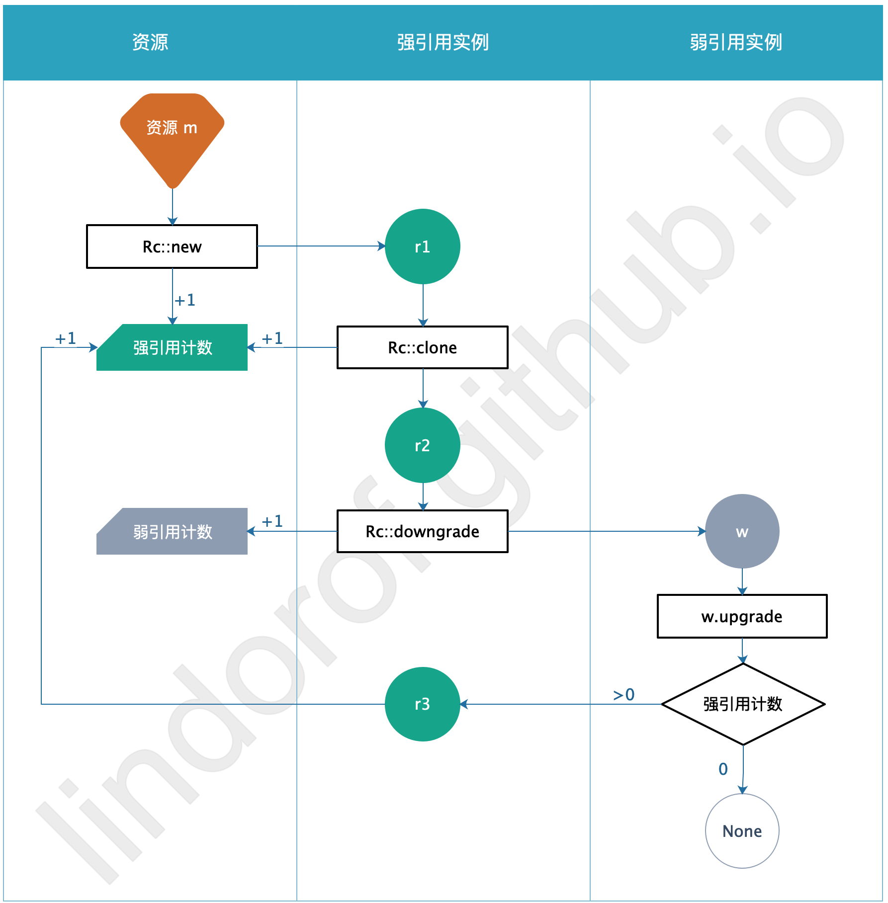
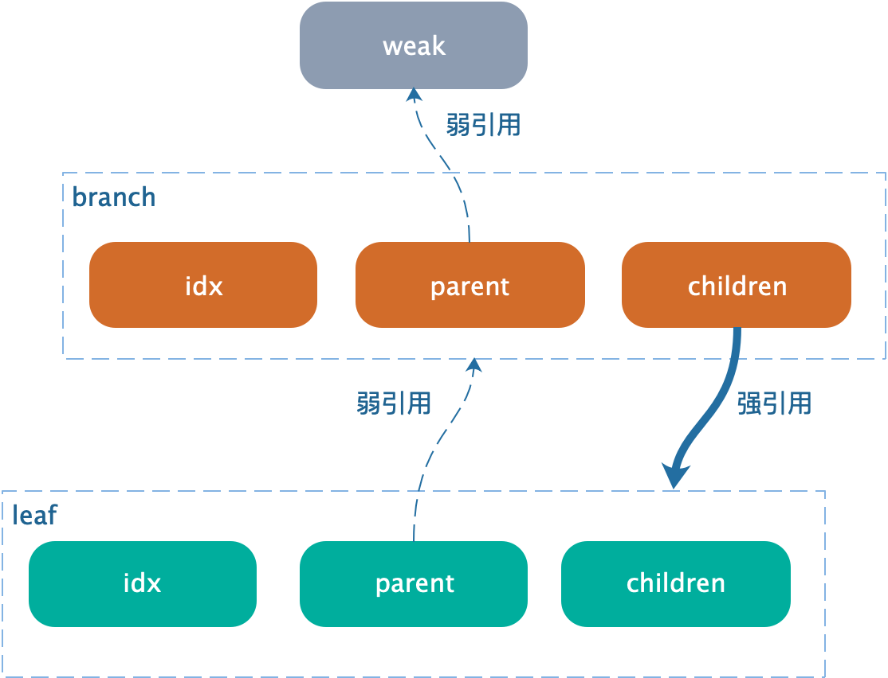

# 15.6. 循环引用

## 概述

### 循环引用

- 前面详细讲解了 `Rc` ，它其实可以理解为 C++ 中的 指针

- 而 C++ 的指针非常灵活，既然现在有了替代品 `Rc` ，那就又可以发挥这个灵活性了

- 例如，创造一个循环引用，用 C++ 的语言来描述：

    1. 创建指针 a ，初始化为 null
    2. 创建指针 b，指向 a
    3. 更改指针 a ，让它指向 b

- rust 编译器对于这个循环引用的过程是无能为力的


### 内存泄露

- 循环引用不等价于内存泄露
- 但循环引用为内存泄露制造了可能性
- 例如在循环过程中分配内存，就会导致内存耗尽

### 解决办法

1. 循环引用是程序的 bug ，通过测试等软件手段，消除程序 bug
2. rust 为 `Rc` 提供了强引用和弱引用，后续讲解


## 制造循环引用

### 场景

下面先制造一个循环引用感受一下，原书中例子太复杂，这里简化一点，思路如下图：



> 步骤描述：

1. 让指针 a 先指向 null
    - 这需要先创建一个 `enum Rlist` ，有两种值：
        - `Nil`
        - `Val(Rc<RList>)`
    - 让 a 存储 `RList` 的实例，且该 `RList` 的值是 `Nil`
2. 让指针 b 指向 a
    - 这一步比较简单，创建 `RList` 的实例
    - 且该 `RList` 的值是通过 `Rc` 指向 a
3. 让指针 a 指向 b
    - 此时发现，只用 `Rc` 是不够的，还需要 `RefCell` 才能达到可变性
    - 所以要将 `Val` 的类型改为 `RefCell<Rc<RList>>`


### 代码

代码如下，注意看注释：

```rust
use std::rc::Rc;
use std::cell::RefCell;
use RList::*;

#[derive(Debug)]
enum RList {
	Val(RefCell<Rc<RList>>),
	Nil,
}

fn main() {
    
    //创建 a ，先指向 Nil
	let a = Rc::new(Val(RefCell::new(Rc::new(Nil))));
    // 此时 a 的引用计数是 1
	println!("<a> create a = {}", Rc::strong_count(&a));

    // 创建 b ，指向 a
	let b = Rc::new(Val(RefCell::new(Rc::clone(&a))));
    // 此时 a 的引用计数是 2
    // 此时 b 的引用计数是 1
	println!("<a> create b = {}", Rc::strong_count(&a));
	println!("<b> create b = {}", Rc::strong_count(&b));

    /*
    让 a 指向 b
    注意：
    第一，必须使用 if let 或者 match ，因为类型是 enum
    第二，必须先 *a ，从 Rc 中得到 Val 的值
    第三，然后再 & ，得到 &Val
    否则，会导致 Val 被 Move 掉
    */
	if let Val(rcell) = &*a {
		*rcell.borrow_mut() = Rc::clone(&b);
	}

    // 此时 a 和 b 的引用计数都是 2
	println!("<a> ref cycle = {}", Rc::strong_count(&a));
	println!("<b> ref cycle = {}", Rc::strong_count(&b));

    /*
    此时打印 a ，就会一直循环到栈溢出
    */
	//println!("{:?}", a);
}
```

执行结果如下：

```shell
<a> create a = 1
<a> create b = 2
<b> create b = 1
<a> ref cycle = 2
<b> ref cycle = 2
```


## 强引用和弱引用

### 概念解释

#### 强引用

- 通过 `Rc::new()` 来创建新的强引用
- 通过 `Rc::clone()` 来创建共享的强引用
- 得到的类型是 `Rc`

#### 弱引用

- 通过 `Rc::downgrade()` 来创建
- 得到的类型是 `Weak`
- 通过 `Weak` 实例 `w` 的方法 `w.upgrade()` 来得到 `Option<Rc<T>>`
    - 如果 `Rc` 还存在，则得到 `Some(Rc)`
    - 如果 `Rc` 已不存在，则得到 `None`

#### 强引用计数

- 通过 `Rc::strong_count()` 得到强引用计数，也就是 `Rc` 实例的个数
- 注意：强引用个数包含了下面的 `Rc` 实例：
    1. `Rc::new()` 所得到的 `Rc`
    2. `Rc::clone()` 所得到的 `Rc`
    3. `w.upgrade()` 所得到的 `Rc`
- 只要强引用计数不为 0 ，则 `Rc` 所存储的资源就不会被清理

#### 弱引用计数

- 通过 `Rc::weak_count()` 得到弱引用计数，也就是 `Weak` 实例的个数

- 当强引用计数为 0 时：

    - `Rc` 所存储的资源就会被清理
    - 而 `w.upgrate()` 就得到 `None`

- 而弱引用计数不影响资源的清理，仅仅只是计数


### 概念图示

强/弱引用的概念如下图所示，特别注意计数的变化：




## 树形结构

### 场景

树形结构会使用到前面讲解的强引用和弱引用，功能描述如下：

- 树形结构中的一个个节点，叫 `Node`
- 每个节点中，首先是自身的值，叫 `idx`
- 每个节点都会有子节点，如果是叶子，则没有子节点，因此需要 `Vec` 来存储
- 我们希望共享节点的所有权，因此 `Vec` 中存储的类型是 `Rc<Node>` ，即 `Vec<Rc<Node>>`
- 子节点列表可能新增或删除，因此需要 `RefCell` ，即 `RefCell<Vec<Rc<Node>>>`
- 每个节点也需要找到所属的父节点，但如果是 `Rc<Node>` ，则出现了循环引用
- 按照弱引用的逻辑，通过子节点能沟找到父节点；但如果父节点不存在了，那么子节点找到的父节点就是 `None`
- 所以，父节点需要为 `Weak<Node>` 
- 同时，可能在节点创建之后，才能确定父节点，因此父节点类型是 `RefCell<Weak<Node>>`

该树形结构示意图如下：




### 代码实现

> `Node` 的类型定义如下：

```rust
use std::rc::{Rc, Weak};
use std::cell::RefCell;

#[derive(Debug)]
struct Node {
	idx: i32,
	parent: RefCell<Weak<Node>>,
	children: RefCell<Vec<Rc<Node>>>,
}
```

> 下面是 `fn main()` 的测试过程，按顺序逐步实现代码如下：

创建一个叶子节点：

```rust
let leaf = Rc::new(Node {
    idx: 3,
    // 还未能确定父节点的时候
    // 可以创建 Weak 空引用
    // 但注意 Rc 是不可以创建空引用的
    parent: RefCell::new(Weak::new()),
    // 叶子的子节点为空
    children: RefCell::new(vec![]),
});

println!("\n==========[create leaf]");
// 父节点不存在，因此打印为 None
println!("leaf.parent = {:?}",
          leaf.parent.borrow().upgrade());
// 此时该节点只有 1 个强引用(leaf) 
// 然后弱引用为 0
println!("leaf strong = {}, weak = {}", 
          Rc::strong_count(&leaf), 
          Rc::weak_count(&leaf));
```

打印结果如下：

```shell
==========[create leaf]
leaf.parent = None
leaf strong = 1, weak = 0
```

然后创建一个父节点：

```rust
let branch = Rc::new(Node {
    idx: 5,
    // 没有父节点，创建 Weak 空引用
    parent: RefCell::new(Weak::new()),
    // 子节点是 leaf
    // 使用 Rc::clone(&leaf)
    children: RefCell::new(vec![Rc::clone(&leaf)]),
});
// 将 leaf 的父节点设置为 branch
// 注意通过 Rc::downgrade 来为 branch 创建弱引用
*leaf.parent.borrow_mut() = Rc::downgrade(&branch);

println!("\n==========[create branch]");
// 打印出 leaf 的父节点即 branch 的内容
// 注意 branch 的内容包含了子节点列表，即包含了 leaf 的内容
// 注意观察输出结果，涉及到弱引用时只会打印为 'Weak'
// 从而避免了循环递归打印的栈溢出
println!("leaf.parent = {:#?}",
          leaf.parent.borrow().upgrade());
// 此时 leaf 有 2 个强引用(leaf和branch)
// 而弱引用为 0
println!("leaf strong = {}, weak = {}",
          Rc::strong_count(&leaf),
          Rc::weak_count(&leaf));
// 此时 branch 有 1 个强引用(branch)
// 有 1 个弱引用(leaf)
println!("branch strong = {}, weak = {}",
          Rc::strong_count(&branch), Rc::weak_count(&branch));
```

打印结果如下：

```shell
==========[create branch]
leaf.parent = Some(
    Node {
        idx: 5,
        parent: RefCell {
            value: (Weak)
        },
        children: RefCell {
            value: [
                Node {
                    idx: 3,
                    parent: RefCell {
                        value: (Weak)
                    },
                    children: RefCell {
                        value: []
                    }
                }
            ]
        }
    }
)
leaf strong = 2, weak = 0
branch strong = 1, weak = 1
```

然后手动销毁 branch ，看看引用计数的变化：

```rust
// 手动销毁 branch
drop(branch);

println!("\n==========[drop branch]");
// 此时 leaf 的父节点 branch 被销毁
// 因此得到 None
println!("leaf.parent = {:#?}",
          leaf.parent.borrow().upgrade());
// 此时 leaf 剩下 1 个强引用(leaf)
// 而弱引用一直为 0
println!("leaf strong = {}, weak = {}",
          Rc::strong_count(&leaf),
          Rc::weak_count(&leaf));
```

> 注意：
>
> - 上面的代码里，`w.upgrade()` 直接使用在 `println!` 中
> - 也就是说，产生的 `Some<Rc>` 只是临时变量，在 `println!` 之后就自动被销毁
> - 但实际上，`upgrade` 也会产生强引用(如果不是 `None` 的话)，并增加强引用计数
> - 例如，更改一下创建 branch 之后的代码，观察强引用计数的变化：

```rust
// 创建 branch
// --SNIP--

println!("\n==========[create branch]");
// 使用变量来存储 upgrade 的结果
let ugp = leaf.parent.borrow().upgrade();
// 此时 branch 有 2 个强引用(branch 和 ugp)
// 有 1 个弱引用(leaf)
println!("branch strong = {}, weak = {}",
          Rc::strong_count(&branch),
          Rc::weak_count(&branch));
```

