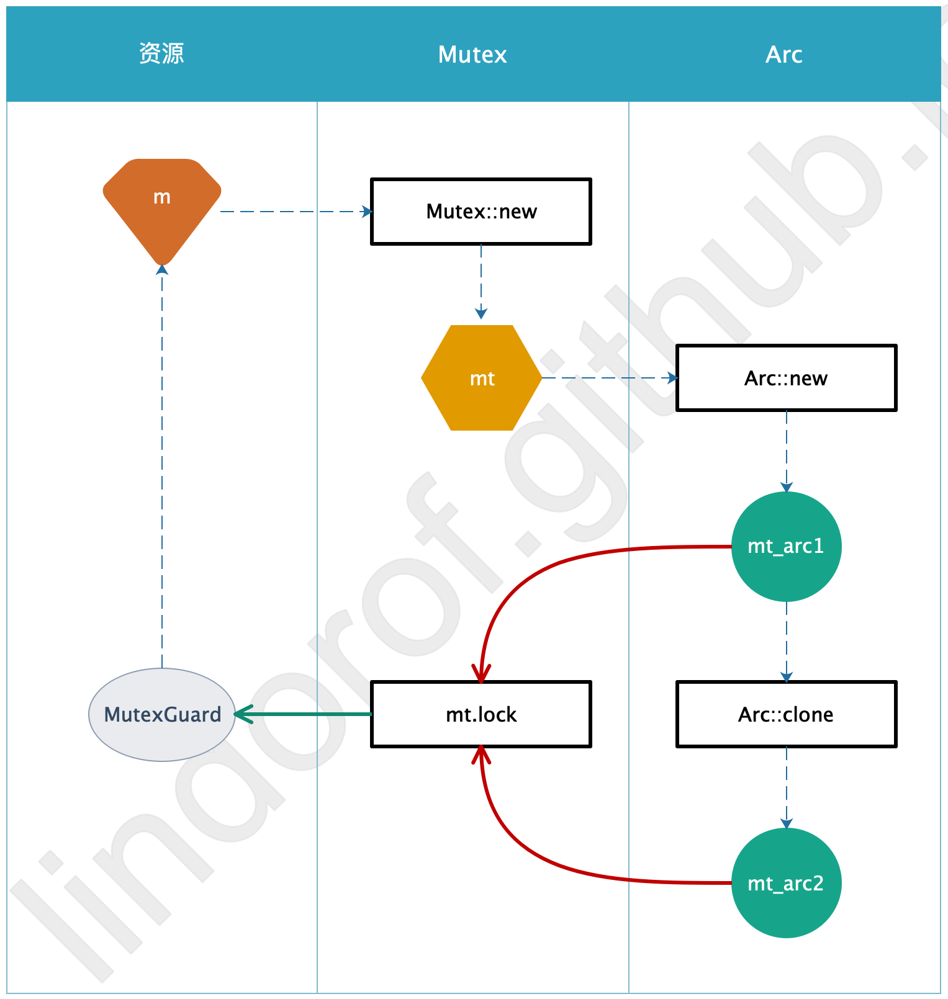

# 16.3. 共享数据

## 理念

### 回顾

- 虽然消息传递是很好的处理并发的方式，但并不是唯一一种方式
- 仍然可以通过共享数据的方式，来完成并发处理
- 消息传递比较简单：
    - 一个通道，多个发送者，一个接收者
    - 各个发送者和接收者之间互不干扰，独立处理
    - 通道中的数据会被串行依次处理
- 而共享数据就比较复杂：
    - 多个线程都会访问同一份数据
    - 也就是说，多个线程都会拥有同一份数据的所有权
    - 而为了数据安全，多个线程不能同时处理该数据，否则会造成数据错误
    - 也就是说，针对该数据，需要使用互斥器来进行保护


### 互斥器

- ***互斥器***（*mutex*）是 *mutual exclusion* 的缩写
- 它确保任何时刻，都只有一个线程能够访问到数据
- 所以，互斥器的流程是：
    1. 获取互斥器的锁
    2. 访问数据
    3. 释放互斥器的锁
    4. 其它线程继续获取互斥器的锁，重复上述流程

- 因此，互斥器比较复杂，因为涉及到多个步骤，而某个步骤忘记执行、或执行出错，都会导致其它线程无法再访问到数据
- 在 rust 中，基于类型系统和所有权，确保了互斥器的获取锁/释放锁不会出错


## Rust 共享数据

### 互斥器

- rust 提供的互斥器是 `Mutex<T>` ：
    - `T` 是要保护的数据
    - `Mutex` 是提供保护的互斥器
- `Mutex` 提供`lock` 方法来获取锁：
    - `lock` 会阻塞等待，直到获取到锁
    - 获取到锁后，得到的结果是 `MutexGuard`
    - `MutexGuard` 实现了 `Deref` 和 `Drop` ：
        - `Deref` 用来指向内部数据
        - `Drop` 用来释放锁
    - 因此，基于 rust 的所有权规则，获取到的锁总是能确保被释放
- `Mutex` 所保护的数据是可变的，也就是说，获取到锁以后，可以改变数据内容


### 多线程控制

#### 问题

- 既然要多线程共享数据，则线程中需要能够访问该数据
- 而线程中要访问该数据，就需要 move 闭包
- 而要完成数据保护，则需要 `Mutex`
- 可是 `Mutex` 本身也是数据，不可能同时被 move 闭包到多个线程中

#### 解决

- 要实现多线程共享数据，而且进行数据保护，就必须实现一点：`Mutex` 必须共享所有权
- 就类似于 `Rc` ，能够共享同一份数据的所有权，但要注意，此处共享所有权的数据，不是多线程之间要共同访问的那份数据，而是 `Mutex` 实例本身
- 但之前讲过，`Rc` 不能在多线程中使用，因为多线程之间的计数控制和资源销毁会出问题
- 所以，rust 提供了另一个类似 `Rc` 的实现，就是 `Arc`

#### `Arc<T>`

- `Arc` 的意思是 *atomic reference counter* ，也就是原子性的
- 正是通过原子性，才确保了多线程之间的计数控制和资源销毁的正确性
- 所以，`Arc` 是一个多线程版的 `Rc`
- 因此，rust 提供了单线程的 `Rc` 和 多线程的 `Arc` ，原因就是多线程之间的原子性控制会损失性能，所以可以根据场景来选择使用 `Rc` 或 `Arc`

#### 结论

- 要实现多线程共享数据，就需要结合 `Arc` 和 `Mutex` 来使用
- 也就是 `Arc<Mutex<T>>`


### `Refcell` / `Rc` & `Mutex` / `Arc`

>  注意，下述讨论所针对的是 ***实例中所存储的数据***，而不是 ***实例本身***

#### 可变性

- `RefCell` 和 `Mutex` 都提供可变性
- `Rc` 和 `Arc` 只能是不可变的

#### 所有权

- `RefCell` 和 `Mutex` 中只提供单一所有权
- `Rc` 和 `Arc` 可通过 `clone` 来得到新的所有者

#### 多线程

- `Rc` 和 `RefCell` 只能使用在单线程中
- `Arc` 和 `Mutex` 可以使用在多线程中

#### 关系图

`Mutex` / `Arc` 关系图如下：




## 实现共享数据

### 用法

- `Mutex` 和 `Arc` 都在 `std::sync` 中
- 假设资源为 m ，则使用 `Mutex::new(m)` 来创建互斥器 `mt`
- 使用 `Arc::new(mt)` 创建一个 `Arc` 实例 `arc1`
- 使用 `Arc::clone(&arc1)` 来创建新的所有者 `arc 2`
- 使用 `mt.lock().unwrap()` 来得到 `MutexGuard` 实例 `mtg`
- 通过 `mtg` ，可访问到资源 m ，例如 `*mtg` 

### 示例

下面是一个多线程共享数据的场景：

- 创建多个线程
- 这些线程共享 `Vec<String>`
- 每个线程都在 `Vec<String>` 中加入一个当前线程标识，例如 `str3`
- 对于 `Vec<String>` ，需要使用 `Mutex` 进行互斥保护
- 为了将互斥器在多个线程中共享，需要使用 `Arc`

对应代码如下，注意看注释：

```rust
use std::thread;
// 需使用 Mutex 和 Arc
use std::sync::{Mutex, Arc};

fn main() {
    // 要共享的数据是 Vec<String>
    // 使用 Mutex 进行互斥保护
    // 再通过 Arc 来在多线程间共享 Mutex
	let sv = Arc::new(Mutex::new(vec![]));
    // 将多个线程句柄存储在 Vec 中
	let mut hd = vec![];

	for i in 1..10 {
        // 为每个线程克隆一个 Mutex 的所有者
        // 并将该 Mutex 的所有者 move 闭包到线程中
		let sv_arc = Arc::clone(&sv);
        // 存储该子线程的句柄
		hd.push(thread::spawn(move || {
            // 根据索引来生成当前线程的标识字符串
			let s = format!("str{}", i);
            // 互斥获得 Vec<String> 的访问
            // 并在 Vec<String> 中加入当前线程的标识字符串
            // [*①]
			sv_arc.lock().unwrap().push(s);
		}));
	}

    // 等待所有线程执行结束
	for h in hd {
		h.join().unwrap();
	}

    // 互斥获得 Vec<String> 的访问
    // 并打印 Vec<String> 中的内容
    // 从而可以观察到各个线程的执行顺序
    // [*②]
	for s in &*sv.lock().unwrap() {
		println!("{}", s);
	}
}
```

注意对共享数据的解引用：

- [*①]
    - 此时需要在 `Vec<String>` 中加入字符串
    - 所以可以直接 `.push()` ，因为 rust 会自动解引用
- [*②]
    - 此时需要打印 `Vec<String>` 中的内容
    - `for` 循环不会自动解引用，以为 rust 无法推断最终要打印的类型
    - 所以首先需要 `*MutexGuard` 来进行解引用，得到 `Vec<String>`
    - 但是不能将 `Vec<String>` 的所有权 move 到 `for` 中
    - 因此又需要 `&` 来进行引用，得到 `&Vec<String>`

打印结果可能如下：

```shell
str4
str5
str6
str2
str1
str3
str7
str9
str8
```

