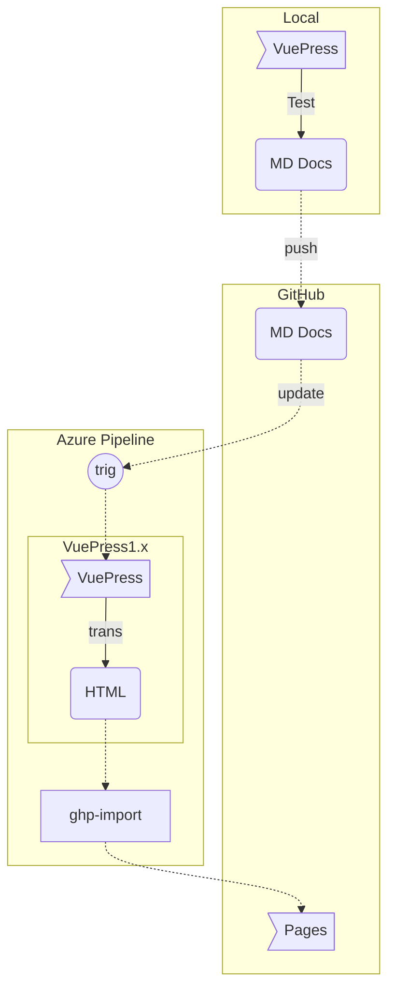

# 建站指南

## 建站方案

#### 站点搭建思路

- 使用 [VuePress 1.x](https://v1.vuepress.vuejs.org/zh/) 搭建页面框架
- 使用 MD 语法编写技术文档
- 通过 [VuePress 1.x](https://v1.vuepress.vuejs.org/zh/) 自动将 MD 转换为静态 HTML 页面
- 将转换后的静态 HTML 页面托管在 [GitHub](https://github.com) 的 Pages 服务中

#### 文档版本管理

- 使用 [GitHub](https://github.com) 仓库进行文档版本管理
- 将 MD 文档和 HTML 页面 分别存放于仓库的两个分支中
- 其中，[VuePress 1.x](https://v1.vuepress.vuejs.org/zh/) 环境与 MD 技术文档都在一个分支中
- 设置 [GitHub](https://github.com) 的 Pages 服务为 HTML 页面分支

#### 自动发布方案

- 使用 [Microsoft Azure Pipeline](https://dev.azure.com) 完成自动构建和部署
- 在 MD 技术文档分支更新时，自动进行  [VuePress 1.x](https://v1.vuepress.vuejs.org/zh/) 构建，并将构建后的 HTML 发布到 Pages 服务分支
- 其中，使用了 [ghp-import](https://github.com/davisp/ghp-import) 开源脚本，来完成将本地 HTML 页面 ```push``` 到 [GitHub](https://github.com) 的 Pages 分支的工作

#### 方案流程总述

1. 建立 [VuePress 1.x](https://v1.vuepress.vuejs.org/zh/) 环境
2. 编写 MD 技术文档
3. 通过 [VuePress 1.x](https://v1.vuepress.vuejs.org/zh/) 在本地预览站点及文章
4. 将 MD 技术文档 ```push``` 到 [GitHub](https://github.com) 
5. 触发  [Microsoft Azure Pipeline](https://dev.azure.com) 自动构建和发布

## 流程展示




