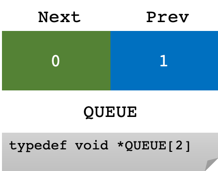
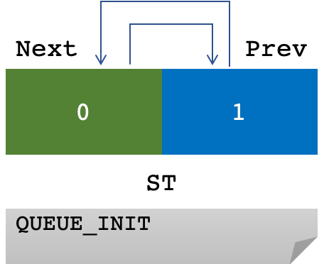
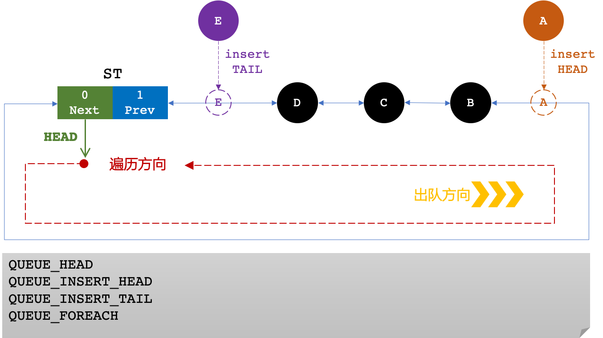
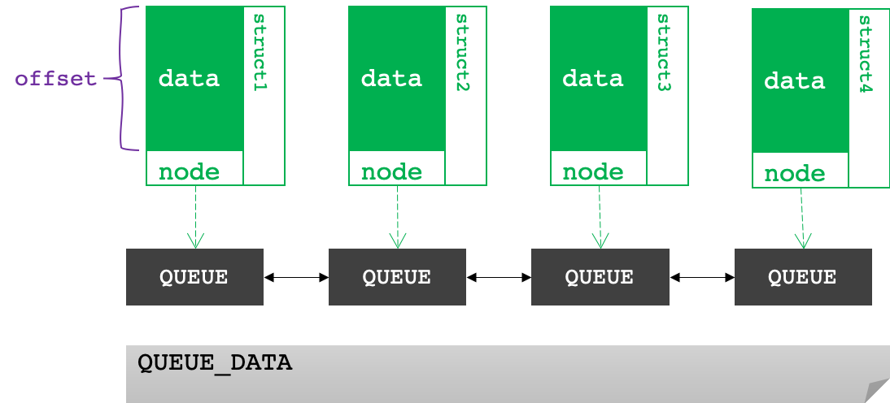

# libuv-queue-学习心得 

通过对 libuv 源代码 `queue.h` 的学习，大致明白了实现原理：

- 先进先出
- 双向队列
- 通过偏移量计算，实现队列元素与数据内容的关联
- 全部通过宏实现，具体可研读代码，本文主要总结原理和心得
- *文末提供了一个简单的例子*


## queue 的定义




## queue 的初始化




## queue 的插入和遍历




## queue 的数据关联




## 代码举例

下面是一份简单的代码，对上述原理进行了实践，注意看注释。

```cpp
#include <iostream>
//libuv-queue源文件
#include "queue.h"
using namespace std;

//数据类型是 struct _student_
typedef struct _student_ {
    //数据域
    int age;
    char name[100];
    //通过 node 来组装链表
    QUEUE node;
} STUDENT ;

int main() {

    //数据1
    STUDENT s1;
    s1.age = 18;
    strcpy(s1.name, "Zhang");
    //***所有的QUEUE都必须有初始化
    QUEUE_INIT(&s1.node);

    //数据1
    STUDENT s2;
    s2.age = 36;
    strcpy(s2.name, "Wang");
    //***所有的QUEUE都必须有初始化
    QUEUE_INIT(&s2.node);

    //ST
    QUEUE ST;
    //***所有的QUEUE都必须有初始化
    QUEUE_INIT(&ST);

    //通过 ST 来组装链表
    //将元素插入到末尾，即 TAIL
    QUEUE_INSERT_TAIL(&ST, &s1.node);
    QUEUE_INSERT_TAIL(&ST, &s2.node);

    //从 ST 开始遍历链表
    QUEUE *p;
    QUEUE_FOREACH(p, &ST){
        /*
         * 根据 STUDENT 类型和 node 域来计算 offset，
         * 从而，通过 QUEUE 的某个元素 p ，
         * 即可获得 p 所关联的 STUDENT*
         */
        STUDENT *s = QUEUE_DATA(p, STUDENT, node);
        cout<<"name: "<<s->name<<" age: "<<s->age<<endl;
    }

    return 0;
}
```

下面是程序输出，可以看到队列的先进先出：

```shell
name: Zhang age: 18
name: Wang age: 36
```

