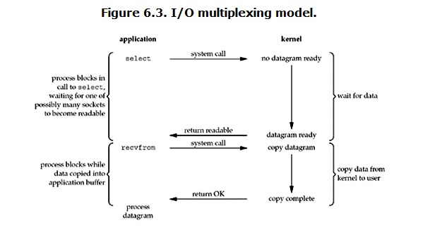

# UNIX网络IO模型

## 概述

### 参考文献

- 『UNIX® Network Programming Volume 1, Third Edition: The Sockets Networking 』，Richard Stevens，6.2节，「I/O Models」

### 五种 IO Model

Stevens在文章中一共比较了五种 IO Model ：

- blocking IO
- nonblocking IO
- IO multiplexing
- signal driven IO （本文未讲解）
- asynchronous IO

### 基础

> 对于一个network IO (例如read)，会涉及两个系统对象：

1. 调用这个IO的process (or thread)
2. 系统内核(kernel)

>当一个read操作发生时，会经历两个阶段：

1. 等待数据准备 (Waiting for the data to be ready)
2. 将数据从内核拷贝到进程中 (Copying the data from the kernel to the process)

## blocking IO

1. process调用recvfrom
2. kernel开始IO的第一个阶段，即准备数据
3. 对于network io来说，可能数据还未到达，例如还未收到一个完整的UDP包
4. 因此kernel开始需要等待足够的数据到来
5. 对于process来说就被阻塞
6. kernel一直等到数据准备完毕
7. kernel将数据从kernel拷贝到用户内存并返回结果
8. process解除block状态
9. 所以，blocking IO的特点就是在IO执行的两个阶段都被block了

## non-blocking IO

1. process调用recvfrom
2. kernel数据还未准备好
3. kernal不会block process，而是立即返回error
4. process的调用立即返回并得到一个结果
5. process判断结果是error，则知道数据还未准备好
6. process从而可以再次发送recvform
7. kernel的数据已准备完毕，并再次收到了process的recvfrom
8. kernel立即将数据拷贝到用户内存并返回
9. 所以，process需要不断的主动询问kernel数据是否准备完毕

## IO multiplexing

1. IO multiplexing即select/epoll
2. process调用select，被block
3. kernel会监视select的所有socket
4. 任何一个socket的数据准备完毕时，select就会返回
5. 此时process再调用read，将数据从kernel拷贝到用户内存
6. blocking IO只需要调用一个system call (recvfrom)，但IO multiplexing需要调用两个system call (select和recvfrom)
7. select的优势是可以同时处理多个connection
8. 若连接数不高时，select/epoll不比multi-threading + blocking IO性能更好
9. select/epoll的优势并不是对单个连接处理更快，而是能处理更多连接
10. 实际使用IO multiplexing时，一般将每个socket都设置成为non-blocking，但process仍然被select所block，而不是被socket IO所block

## asynchronous IO

1. process调用recvfrom
2. kernel立即返回，不会block process
3. kernel等待数据准备完毕，然后将数据拷贝到用户内存
4. kernal向process发送signal，以告知read完成

## 区别

1. blocking IO会一直block住对应的进程直到操作完成
2. non-blocking IO在kernel还未准备好数据的情况下会立刻返回
3. synchronous IO做「IO operation」的时候会将process阻塞
4. asynchronous IO在发起IO操作之后到「IO operation」完成都不会block process
5. 所以可分类为：
    - asynchronous IO
    - synchronous IO (blocking IO，non-blocking IO，IO multiplexing)
6. 其实不必纠结于分类，有的文献中就认为asynchronous IO和non-blocking IO是一个东西

## 总结

1. non-blocking IO和asynchronous IO区别很明显
2. non-blocking IO仍然要求process主动check数据是否准备完毕
3. non-blocking IO在数据准备阶段是non-blocking，在数据拷贝阶段是blocking
4. asynchronous IO只需在发起IO请求后等待kernel操作完毕后的信号通知即可
5. asynchronous IO所谓的操作完毕包括数据准备完毕和数据拷贝完毕

